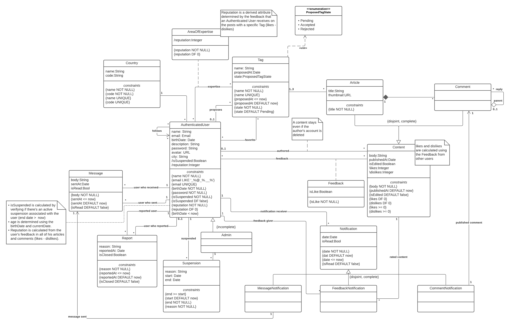

# EBD: Database Specification Component

Newtify aims to bring an innovative news system to the market, whose content is fully maintained by its users. This Web Application allows users to contribute to the community, by writing news or reading them, and providing their feedback.

## A4: Conceptual Data Model

The objective of this artefact is to showcase the platform's conceptual data model which contains the UML class diagram and additional business rules, specifying the relationships that are relevant to the database.

### 1. Class diagram



          Figure 1: UML Class diagram representing the conceptual data model

### 2. Additional Business Rules
 
| Identifier | Name          | Description                                                                                   |
|------------|---------------|-----------------------------------------------------------------------------------------------|
| BR13       | Accepted Tags | A tag can only be used by an user if it was previously accepted by an administrator|
| BR14       | Image Placeholders | If the user doesn't specify an image in the article's thumbnail or the user's profile then a placeholder will be used instead |

                Table 1: Table identifying Business Rules and its descriptions


---


## A5: Relational Schema, validation and schema refinement

This artefact contains the relational schema of the database, mapped from the conceptual data model. It also presents additional domains and the validation of the schema, by exposing functional dependencies and normal forms.

### 1. Relational Schema

Relation schemas are specified in the compact notation:

| Relation Reference | Relation Compact Notation                                                                                                                                                                                                   |
| ------------------ | --------------------------------------------------------------------------------------------------------------------------------------------------------------------------------------------------------------------------- 
| R01                | authenticated_user(<ins>id</ins>, name NN, email UK VALID_EMAIL, birth_date NN CK birth_date < NOW, is_admin DF false, description, password NN, avatar, city, is_suspended NN DF false, reputation NN DF 0, country_id -> country NN) |
| R02                | suspension(<ins>id</ins>, reason NN, start DF NOW, end NN CK end >= start, admin_id -> authenticated_user NN, user_id -> authenticated_user NN)                                                                                           |
| R03                | report(<ins>id</ins>, reason NN, reported_at DF NOW CK reported_at <= NOW, is_closed DF false, reported_id -> authenticated_user NN, reporter_id -> authenticated_user CK reported_id != reporter_id)                                           |
| R04                | country(<ins>id</ins>, code NN UK, name NN UK)                                                                                                                                                                                                 |
| R05                | tag(<ins>id</ins>, name NN UK, proposed_at DF NOW CK proposed_at <= NOW, state NN DF Pending CK state in PROPOSED_TAG_STATES, proposer_id -> authenticated_user)                                                                                                                                                                                                       |
| R06                | area_of_expertise(<ins>user_id</ins> -> authenticated_user, <ins>tag_id</ins> -> tag, reputation NN DF 0)                                                                                                                                          |
| R07                | favorite_tag(<ins>user_id</ins> -> authenticated_user, <ins>tag_id</ins> -> tag)                                                                                                                                                              |                                                                                                           |
| R08                | message(<ins>id</ins>, body NN, sent_at DF NOW CK sent_at <= NOW, sender_id -> authenticated_user NN, receiver_id -> authenticated_user NN, is_read DF false)                                                                          |
| R09                | follow(<ins>follower_id</ins> -> authenticated_user, <ins>followed_id</ins> -> authenticated_user CK followed_id != follower_id)                                                                                                                                            |
| R10                | content(<ins>id</ins>, body NN, published_at DF NOW, is_edited DF false, likes DF 0 CK likes >= 0, dislikes DF 0 CK dislikes >= 0, author_id -> authenticated_user)                                                                 |
| R11                | article(<ins>content_id</ins> -> content, title NN, thumbnail)                                                                                                                                                                       |
| R12                | comment(<ins>content_id</ins> -> content, article_id -> article NN, parent_comment_id -> comment)                                                                                                                                    |
| R13                | feedback(<ins>id</ins>, user_id -> authenticated_user, content_id -> content NN, is_like NN)                                                                                                                                               |
| R14                | article_tag(<ins>article_id</ins> -> article, <ins>tag_id</ins> -> tag)                                                                                                                                                                       |
| R15                | notification(<ins>id</ins>, date NN DF NOW CK date <= NOW, is_read DF false, receiver_id -> authenticated_user NN, msg -> message, fb_giver -> authenticated_user, rated_content -> content, new_comment -> comment, type NN CK type in NOTIFICATION_TYPE)

In order to decrease the number of joins that we do when querying notifications and, consequently, increase the efficiency of the database, we used the approach of using nulls, since we won't fetch notifications by a specific type. They'll be used for logic in the application.

Legend:
- UK = UNIQUE KEY
- NN = NOT NULL
- DF = DEFAULT
- CK = CHECK
- NOW = CURRENT_TIMESTAMP

### 2. Domains

Specification of additional domains:

| Domain Name | Domain Specification           |
| ----------- | ------------------------------ |
| PROPOSED_TAG_STATES  | ENUM ('Pending', 'Accepted', 'Rejected') |
| NOTIFICATION_TYPE | ENUM('MESSAGE', 'FEEDBACK', 'COMMENT') |
| VALID_EMAIL | TEXT CHECK(VALUE LIKE '_%@_%.__%') |

### 3. Schema validation

In order to validate the Relational Schema obtained from the Conceptual Model, the keys, functional dependencies and normal form of each Relation were identified. 


| **Table R01** (authenticated_user) |                                                                                                                                       |
|------------------------------------|-----------------------------------------------------------------------------------------------------------------------------------------------|
| **Keys**                           | {id}, {email}                                                                                                                                 |
| **Functional Dependencies**        |                                                                                                                                               |
| FD0101                             | {id} -> {name, email, birth_date, description, is_admin, password, avatar, city, country_id, is_suspended, reputation} |
| FD0102 | {email} -> {id, name, birth_date, description, is_admin password, avatar, city, country_id, is_suspended, reputation} |
| **Normal Form**                    | BCNF                                                                                                                                          |

| **Table R02** (suspension)  |                                         |
|-----------------------------|-------------------------------------------------|
| **Keys**                    | {id}                                            |
| **Functional Dependencies** |                                                 |
| FD0201                      | {id} -> {reason, start, end, admin_id, user_id} |
| **Normal Form**             | BCNF                                            |


| **Table R03** (report)      |                                                            |
|-----------------------------|--------------------------------------------------------------------|
| **Keys**                    | {id}     |
| **Functional Dependencies** |                                                                    |
| FD0301                      | {id} -> {reason, reported_at, is_closed, reported_id, reporter_id} |
| **Normal Form**             | BCNF                                                               |


| **Table R04** (country)     |                  |
|-----------------------------|------------------|
| **Keys**                    | {id}, {code}, {name} |
| **Functional Dependencies** |                  |
| FD0401                      | {id} -> {code, name} |
| FD0402                      | {code} -> {id, name} |
| FD0403                      | {name} -> {id, code} |
| **Normal Form**             | BCNF             |


| **Table R05** (tag)         |         |
|-----------------------------|----------------|
| **Keys**                    | {id}, {name}   |
| **Functional Dependencies** |                |
| FD0501                      | {id} -> {name, proposed_at, state, proposer_id} |
| FD0502                      | {name} -> {id, proposed_at, state, proposer_id} |
| **Normal Form**             | BCNF           |


| **Table R06** (area_of_expertise) |                            |
|-----------------------------------|-----------------------------------|
| **Keys**                          | {user_id, tag_id}                 |
| **Functional Dependencies**       |                                   |
| FD0601                            | {user_id, tag_id} -> {reputation} |
| **Normal Form**                   | BCNF                              |

| **Table R07** (favorite_tag) |            |
|--------------------------------|-------------------|
| **Keys**                       | {user_id, tag_id} |
| **Functional Dependencies**    |     none          |
| **Normal Form**                | BCNF              |


| **Table R08** (message)     |                                             |
|-----------------------------|----------------------------------------------------|
| **Keys**                    | {id}     |
| **Functional Dependencies** |                                                    |
| FD0801                      | {id} -> {body, sent_at, sender_id, receiver_id, is_read} |
| **Normal Form**             | BCNF                                               |

| **Table R09** (follow)      |                     |
|-----------------------------|----------------------------|
| **Keys**                    | {follower_id, followed_id} |
| **Functional Dependencies** | none                       |
| **Normal Form**             | BCNF                       |


| **Table R10** (content)     | content                                                             |
|-----------------------------|---------------------------------------------------------------------|
| **Keys**                    | {id}                                                                |
| **Functional Dependencies** |                                                                     |
| FD1001                      | {id} -> {body, published_at, is_edited, likes, dislikes, author_id} |
| **Normal Form**             | BCNF                                                                |

| **Table R11** (article)     |                             |
|-----------------------------|------------------------------------|
| **Keys**                    | {content_id}                       |
| **Functional Dependencies** |                                    |
| FD1101                      | {content_id} -> {title, thumbnail} |
| **Normal Form**             | BCNF                               |


| **Table R12** (comment)     |                                          |
|-----------------------------|-------------------------------------------------|
| **Keys**                    | {content_id}                                    |
| **Functional Dependencies** |                                                 |
| FD1201                      | {content_id} -> {article_id, parent_comment_id} |
| **Normal Form**             | BCNF                                            |

| **Table R13** (feedback)    |                |
|-----------------------------|-----------------------|
| **Keys**                    | {id} |
| **Functional Dependencies** |                       |
| FD1301                      | {id} -> {is_like, user_id, content_id} |
| **Normal Form**             | BCNF                  |


| **Table R14** (article_tag) |               |
|-----------------------------|----------------------|
| **Keys**                    | {article_id, tag_id} |
| **Functional Dependencies** |      none            |
| **Normal Form**             | BCNF                 |

| **Table R15** (notification)|                      |
|-----------------------------|----------------------|
| **Keys**                    | {id} |
| **Functional Dependencies** |                      |
| FD1501                      | {id} -> {date, is_read, receiver_id, msg, fb_giver, rated_content, new_comment, type} |
| **Normal Form**             | BCNF                 |


Since all relations are in the Boyce–Codd Normal Form (BCNF), the relational schema is also in the BCNF and so there is no need to further normalise it. 


## A6: Indexes, triggers, transactions and database population

This artefact contains the workload analysis database, proposed indices, triggers and transactions, as well as the two scripts (annex) which create the schema of the database and populate it, respectively. The objective is to concretely define the database used in the application.

### 1. Database Workload
 
> A study of the predicted system load (database load).
> Estimate of tuples at each relation.

| **Relation reference** | **Relation Name** | **Order of magnitude**        | **Estimated growth** |
| ------------------ | ------------- | ------------------------- | -------- |
| R01      | authenticated_user    | tens of thousands     | dozens / day     |
| R02      | suspension            | hundreds              | dozens / month   |
| R03      | report                | hundreds              | dozens / week    |
| R04      | country               | dozens                | almost none      |
| R05      | tag                   | hundreds              | units / day      |
| R06      | area_of_expertise     | tens of thousands     | dozens / day     |
| R07      | favorite_tag          | tens of thousands     | dozens / day     |
| R08      | message               | hundreds of thousands | hundreds / day   |
| R09      | follow                | tens of thousands     | dozens / day     |
| R10      | content               | tens of thousands     | hundreds / day   |
| R11      | article               | thousands             | dozens / day     |
| R12      | comment               | tens of thousands     | hundreds / day   |
| R13      | feedback              | hundreds of thousands | hundreds / day   |
| R14      | article_tag           | thousands             | dozens / day     |
| R15      | notification          | hundreds of thousands | hundreds / day   |


### 2. Proposed Indices

#### 2.1. Performance Indices

| **Index**         | **IDX01**                                                                                                                                                                                                                                                                      |
|-------------------|--------------------------------------------------------------------------------------------------------------------------------------------------------------------------------------------------------------------------------------------------------------------------------|
| **Relation**      | content                                                                                                                                                                                                                                                                        |
| **Attribute**     | author_id                                                                                                                                                                                                                                                                      |
| **Type**          | Hash                                                                                                                                                                                                                                                                           |
| **Cardinality**   | Medium                                                                                                                                                                                                                                                                         |
| **Clustering**    | No                                                                                                                                                                                                                                                                             |
| **Justification** | Queries for content of a specific user are very frequent and the table will be very large. By having a Hash index, we can search for an exact match with more efficiency. Since the table is updated very often and the cardinality is medium, we opted to not use clustering. |
| **SQL Code**      | `CREATE INDEX content_author ON content USING hash (author_id);`                                                                                                                                               

| **Index**         | **IDX02**                                                                                                                                                                                                                                                                                                                                                                           |
|-------------------|-------------------------------------------------------------------------------------------------------------------------------------------------------------------------------------------------------------------------------------------------------------------------------------------------------------------------------------------------------------------------------------|
| **Relation**      | message                                                                                                                                                                                                                                                                                                                                                                             |
| **Attribute**     | (receiver_id, sender_id)                                                                                                                                                                                                                                                                                                                                                            |
| **Type**          | B-tree                                                                                                                                                                                                                                                                                                                                                                                |
| **Cardinality**   | Medium                                                                                                                                                                                                                                                                                                                                                                              |
| **Clustering**    | No                                                                                                                                                                                                                                                                                                                                                                                  |
| **Justification** | The platform requires to search messages that a user received or sent when navigating in the inbox. Since this relation has one of the highest workloads and is queried very often, it's essential to have an index to optimize this task. As hash indices cannot be used with two attributes, we need to use B-tree. Once again, since the relation is updated frequently and the cardinality is medium, we chose not to use clustering.    |
| **SQL Code**      | `CREATE INDEX user_messages ON message USING btree (receiver_id, sender_id);`                                                   ||

| **Index**         | **IDX03**                                                                                                                                                                                                                                                                                                                                                                                                                             |
|-------------------|---------------------------------------------------------------------------------------------------------------------------------------------------------------------------------------------------------------------------------------------------------------------------------------------------------------------------------------------------------------------------------------------------------------------------------------|
| **Relation**      | notification                                                                                                                                                                                                                                                                                                                                                                                                                          |
| **Attribute**     | receiver_id                                                                                                                                                                                                                                                                                                                                                                                                                           |
| **Type**          | Hash                                                                                                                                                                                                                                                                                                                                                                                                                                  |
| **Cardinality**   | Medium                                                                                                                                                                                                                                                                                                                                                                                                                                |
| **Clustering**    | No                                                                                                                                                                                                                                                                                                                                                                                                                                    |
| **Justification** | One of the most frequent queries in the application will be fetching notifications of a user. As such, there's the need to have a hash index to perform exact search of notifications that a user received, considering the notifications' workload has a high order of magnitude. Finally, thanks to the high estimated growth of this relation and the medium cardinality, we determined that this index shouldn't use clustering.  |
| **SQL Code**      | `CREATE INDEX notification_receiver ON notification USING hash (receiver_id);`                                                                                                                                                                                                                                                                                                                                                        |                                                                                                                                                                                                               |

#### 2.2. Full-text Search Indices 

| **Index**         | **IDX11**                                                                                                                                                                                                                                                                |
|-------------------|--------------------------------------------------------------------------------------------------------------------------------------------------------------------------------------------------------------------------------------------------------------------------|
| **Relation**      | article                                                                                                                                                                                                                                                                  |
| **Attribute**     | (title, body)                                                                                                                                                                                                                                                            |
| **Type**          | GIST                                                                                                                                                                                                                                                                     |
| **Clustering**    | No                                                                                                                                                                                                                                                                       |
| **Justification** | Users will frequently search for articles with a given title or body. As such, we need a full-text search index to efficiently fetch the results of the search. For this, we chose GIST, since it's faster to build and update, as users may create/edit articles often. |

#### Sql Code:
```sql
ALTER TABLE "article" ADD COLUMN tsvectors TSVECTOR;

CREATE FUNCTION article_search_update() RETURNS TRIGGER AS $$
DECLARE new_body text = (select body from "content" where id = NEW.content_id);
BEGIN
  IF TG_OP = 'INSERT' THEN
    NEW.tsvectors = (
      setweight(to_tsvector('english', NEW.title), 'A') ||
      setweight(to_tsvector('english', new_body), 'B')
    );
  END IF;

  IF TG_OP = 'UPDATE' THEN
      IF (NEW.title <> OLD.title OR new_body <> OLD.text) THEN
        NEW.tsvectors = (
          setweight(to_tsvector('english', NEW.title), 'A') ||
          setweight(to_tsvector('english', new_body), 'B')
        );
      END IF;
  END IF;

  RETURN NEW;
END $$
LANGUAGE plpgsql;

CREATE TRIGGER article_search_update
  BEFORE INSERT OR UPDATE ON "article"
  FOR EACH ROW
  EXECUTE PROCEDURE article_search_update();

CREATE INDEX article_search ON "article" USING GIST (tsvectors);
```

| **Index**         | **IDX12**                                                                                                                                                                        |
|-------------------|----------------------------------------------------------------------------------------------------------------------------------------------------------------------------------|
| **Relation**      | authenticated_user                                                                                                                                                               |
| **Attribute**     | (name, email)                                                                                                                                                                    |
| **Type**          | GIST                                                                                                                                                                             |
| **Clustering**    | No                                                                                                                                                                               |
| **Justification** | For it to be possible to search for users by their name or email efficiently, a GIST index is used, since it is faster to build and update, as we are dealing with dynamic data (users can change their name and email). |

#### Sql Code:
```sql
ALTER TABLE "authenticated_user" ADD COLUMN tsvectors TSVECTOR;

CREATE FUNCTION user_search_update() RETURNS TRIGGER AS $$
BEGIN
  IF TG_OP = 'INSERT' THEN
    NEW.tsvectors = (
      setweight(to_tsvector('english', NEW.name), 'A') ||
      setweight(to_tsvector('english', NEW.email), 'B')
    );
  END IF;

  IF TG_OP = 'UPDATE' THEN
      IF (NEW.name <> OLD.name OR NEW.email <> OLD.email) THEN
        NEW.tsvectors = (
          setweight(to_tsvector('english', NEW.name), 'A') ||
          setweight(to_tsvector('english', NEW.email), 'B')
        );
      END IF;
  END IF;

  RETURN NEW;
END $$
LANGUAGE plpgsql;

CREATE TRIGGER user_search_update
  BEFORE INSERT OR UPDATE ON "authenticated_user"
  FOR EACH ROW
  EXECUTE PROCEDURE user_search_update();

CREATE INDEX user_search ON "authenticated_user" USING GIST (tsvectors);
```

### 3. Triggers

| **Trigger**     | **TRIGGER01**                                                                                                     |
|-----------------|-------------------------------------------------------------------------------------------------------------------|
| **Description** | Trigger to update likes/dislikes of a content when feedback is given, creates a notification on that feedback and updates user reputation, as well as its areas of expertise.. |

#### Sql Code:

```sql
CREATE FUNCTION feedback_content() RETURNS TRIGGER AS
$BODY$
DECLARE author_id authenticated_user.id%type = (
  SELECT author_id FROM content INNER JOIN authenticated_user ON (content.author_id = authenticated_user.id)
  WHERE content.id = NEW.content_id
);
DECLARE feedback_value INTEGER = 1;
BEGIN
    IF (NOT NEW.is_like)
        THEN feedback_value = -1;
    END IF;

    IF (NEW.is_like) THEN
        UPDATE content SET likes = likes + 1 WHERE id = NEW.content_id;
    ELSE 
        UPDATE content SET dislikes = dislikes + 1 WHERE id = NEW.content_id;
    END IF;
    
    UPDATE authenticated_user SET reputation = reputation + feedback_value
    WHERE id = author_id;

    UPDATE area_of_expertise SET reputation = reputation + feedback_value
    WHERE 
        user_id = author_id AND 
        tag_id IN (
			SELECT tag_id FROM article_tag
    		WHERE article_id=NEW.content_id
		);

    INSERT INTO notification(receiver_id, is_read, msg, fb_giver, rated_content, new_comment, type)
    VALUES (author_id, FALSE, NULL, NEW.user_id, NEW.content_id, NULL, 'FEEDBACK');

    RETURN NULL;
END
$BODY$
LANGUAGE plpgsql;

CREATE TRIGGER feedback_content
    AFTER INSERT ON feedback
    FOR EACH ROW
    EXECUTE PROCEDURE feedback_content();
```

| **Trigger**     | **TRIGGER02**                                                                                                     |
|-----------------|-------------------------------------------------------------------------------------------------------------------|
| **Description** | Trigger to remove like/dislike of a content when feedback on it is removed and to update authenticated user reputation, as well as its areas of expertise |

#### Sql Code:

```sql 
CREATE FUNCTION remove_feedback() RETURNS TRIGGER AS
$BODY$
DECLARE author_id authenticated_user.id%type = (SELECT author_id FROM content INNER JOIN authenticated_user ON (content.author_id = authenticated_user.id) WHERE content.id = OLD.content_id);
DECLARE feedback_value INTEGER = -1;
BEGIN
    IF (NOT OLD.is_like)
        THEN feedback_value = 1;
    END IF;

    IF (OLD.is_like) THEN
        UPDATE content SET likes = likes - 1 WHERE id = OLD.content_id;
    ELSE 
        UPDATE content SET dislikes = dislikes - 1 WHERE id = OLD.content_id;
    END IF;
    
    UPDATE authenticated_user SET reputation = reputation + feedback_value
    WHERE id = author_id;

    UPDATE area_of_expertise SET reputation = reputation + feedback_value
    WHERE 
        user_id = author_id AND 
        tag_id IN (
			SELECT tag_id FROM article_tag
    		WHERE article_id=OLD.content_id
		);

    RETURN NULL;
END
$BODY$

LANGUAGE plpgsql;

CREATE TRIGGER remove_feedback
    AFTER DELETE ON feedback
    FOR EACH ROW
    EXECUTE PROCEDURE remove_feedback();
```

| **Trigger**     | **TRIGGER03**                                                                                                     |
|-----------------|-------------------------------------------------------------------------------------------------------------------|
| **Description** | Trigger to prevent users from liking or disliking his own content (articles or comments) |

#### Sql Code:

```sql
CREATE FUNCTION check_feedback() RETURNS TRIGGER AS
$BODY$
BEGIN
    IF (NEW.user_id in (
        SELECT content.author_id 
        FROM content 
        WHERE content.id = NEW.content_id)) THEN
            RAISE EXCEPTION 'You cannot give feedback on your own content';
    END IF;
    RETURN NEW;
END;
$BODY$

LANGUAGE plpgsql;

CREATE TRIGGER check_feedback
    BEFORE INSERT ON feedback
    FOR EACH ROW
    EXECUTE PROCEDURE check_feedback();
```

| **Trigger**     | **TRIGGER04**                                                                                                     |
|-----------------|-------------------------------------------------------------------------------------------------------------------|
| **Description** | Trigger to add notification when a message is sent form an user to another or to remove, in case of being read |

#### Sql Code:

```sql
CREATE FUNCTION message_sent_notification() RETURNS TRIGGER AS
$BODY$
BEGIN
    IF (NEW.is_read) THEN
        DELETE FROM notification WHERE msg = NEW.id;
    ELSE 
        INSERT INTO notification(receiver_id, is_read, msg, fb_giver, rated_content, new_comment, type) 
            VALUES (NEW.receiver_id, FALSE, NEW.id, NULL, NULL, NULL, 'MESSAGE');
    END IF;
    RETURN NULL;
END
$BODY$

LANGUAGE plpgsql;

CREATE TRIGGER message_sent_notification
    AFTER INSERT ON message
    FOR EACH ROW
    EXECUTE PROCEDURE message_sent_notification();
```

| **Trigger**     | **TRIGGER05**                                                                                                     |
|-----------------|-------------------------------------------------------------------------------------------------------------------|
| **Description** | Trigger to delete all the information about an article that was deleted it just needs to delete the content represented by that article  since its that deletion is cascaded to the comments and other elements of the article |

#### Sql Code:

```sql
CREATE FUNCTION delete_article() RETURNS TRIGGER AS
$BODY$
BEGIN 
    DELETE FROM content WHERE content.id = OLD.content_id;
    RETURN OLD;
END
$BODY$

LANGUAGE plpgsql;

CREATE TRIGGER delete_article
    AFTER DELETE ON article
    FOR EACH ROW
    EXECUTE PROCEDURE delete_article();
```

| **Trigger**     | **TRIGGER06**                                                                                                                                  |
|-----------------|------------------------------------------------------------------------------------------------------------------------------------------------|
| **Description** | Trigger to delete the respective content of a comment when a comment is deleted. |

#### Sql Code:
```sql
CREATE FUNCTION delete_comment() RETURNS TRIGGER AS
$BODY$
BEGIN 
    DELETE FROM content WHERE content.id = OLD.content_id;
    RETURN OLD;
END
$BODY$

LANGUAGE plpgsql;


CREATE TRIGGER delete_comment
    AFTER DELETE ON comment
    FOR EACH ROW
    EXECUTE PROCEDURE delete_comment();
```

| **Trigger**     | **TRIGGER07**                                                                                                                                  |
|-----------------|------------------------------------------------------------------------------------------------------------------------------------------------|
| **Description** | Trigger to prevent an article from having an unaccepted tag or more than 3 tags |

#### Sql Code:
```sql
CREATE FUNCTION add_article_tag_check() RETURNS TRIGGER AS
$BODY$
BEGIN
    IF ((SELECT state FROM tag WHERE NEW.tag_id = tag.id) <> 'ACCEPTED')
    THEN
        RAISE EXCEPTION 'You cannot associate an article to an Unaccepted tag';
    END IF;
    
    IF ((SELECT COUNT(*) FROM article_tag WHERE article_id = NEW.article_id)) >= 3
    THEN
        RAISE EXCEPTION 'You cannot associate anymore tags to this article';
    END IF;
    RETURN NEW;
END
$BODY$

LANGUAGE plpgsql;

CREATE TRIGGER add_article_tag_check
    BEFORE INSERT ON article_tag
    FOR EACH ROW
    EXECUTE PROCEDURE add_article_tag_check();
```
| **Trigger**     | **TRIGGER08**                                                                                                                                  |
|-----------------|------------------------------------------------------------------------------------------------------------------------------------------------|
| **Description** | Trigger to create an area of expertise when an *article_tag* is inserted, in case the author the article doesn’t have it yet |

#### Sql Code:

```sql
CREATE FUNCTION create_area_expertise() RETURNS TRIGGER AS
$BODY$
DECLARE author_id INTEGER = (
    SELECT author_id FROM content WHERE id = NEW.article_id
);
BEGIN
    IF NEW.tag_id NOT IN (
        SELECT tag_id FROM area_of_expertise where user_id = author_id
    )
    THEN
        INSERT INTO area_of_expertise VALUES(author_id, NEW.tag_id, 0);
	END IF;
	RETURN NULL;
END
$BODY$

LANGUAGE plpgsql;

CREATE TRIGGER create_area_expertise
    AFTER INSERT ON article_tag
    FOR EACH ROW
    EXECUTE PROCEDURE create_area_expertise();
```


| **Trigger**     | **TRIGGER09**                                                                                 |
|-----------------|-----------------------------------------------------------------------------------------------|
| **Description** | Triggers to update the *is_edited* flag when a content's body or an article's title is updated |

#### Sql Code:

```sql
CREATE FUNCTION set_content_is_edited() RETURNS TRIGGER AS
$BODY$
BEGIN
    UPDATE content SET is_edited = TRUE
    WHERE id = NEW.id;
	RETURN NULL;
END
$BODY$

LANGUAGE plpgsql;

CREATE TRIGGER set_content_is_edited
    AFTER UPDATE ON content
    FOR EACH ROW
    WHEN (OLD.body IS DISTINCT FROM NEW.body)
    EXECUTE PROCEDURE set_content_is_edited();


CREATE FUNCTION set_article_is_edited() RETURNS TRIGGER AS
$BODY$
BEGIN
    UPDATE content SET is_edited = TRUE
    WHERE id = NEW.content_id;
	RETURN NULL;
END
$BODY$

LANGUAGE plpgsql;

CREATE TRIGGER set_article_is_edited
    AFTER UPDATE ON article
    FOR EACH ROW
    WHEN (OLD.title IS DISTINCT FROM NEW.title)
    EXECUTE PROCEDURE set_article_is_edited();

```

| **Trigger**     | **TRIGGER10**                                                                                 |
|-----------------|-----------------------------------------------------------------------------------------------|
| **Description** | Trigger to create a notification when a comment is created |

#### Sql Code:

```sql
CREATE FUNCTION create_comment_notification() RETURNS TRIGGER AS
$BODY$
DECLARE article_author INTEGER = (
  SELECT author_id FROM content WHERE id = NEW.article_id
);
DECLARE parent_author INTEGER = (
  SELECT author_id FROM content WHERE id = NEW.parent_comment_id
);
BEGIN
  IF parent_author IS NULL THEN
    INSERT INTO notification(receiver_id, is_read, msg, fb_giver, rated_content, new_comment, type) 
        VALUES (article_author, FALSE, NULL, NULL, NULL, NEW.content_id, 'COMMENT');
  ELSE
    INSERT INTO notification(receiver_id, is_read, msg, fb_giver, rated_content, new_comment, type) 
        VALUES (parent_author, FALSE, NULL, NULL, NULL, NEW.content_id, 'COMMENT');
  END IF;
  RETURN NULL;
END
$BODY$

LANGUAGE plpgsql;
CREATE TRIGGER create_comment_notification
    AFTER INSERT ON comment
    FOR EACH ROW
    EXECUTE PROCEDURE create_comment_notification();
```

| **Trigger**     | **TRIGGER11**                                                                                 |
|-----------------|-----------------------------------------------------------------------------------------------|
| **Description** | Trigger to put authenticated_user flag to true if a suspension on him is created |

```sql
CREATE FUNCTION is_suspended_flag_true() RETURNS TRIGGER AS
$BODY$
BEGIN
    UPDATE authenticated_user SET is_suspended = true
    WHERE id = NEW.user_id;
	RETURN NEW;
END
$BODY$

LANGUAGE plpgsql;

CREATE TRIGGER is_suspended_flag_true
    AFTER INSERT ON suspension
    FOR EACH ROW
    EXECUTE PROCEDURE is_suspended_flag_true();
```

### 4. Transactions
 

| **Transaction**     | TRAN01                                                                                                                                                                                                                                                                                                                                                                                                                                                                       |
|---------------------|------------------------------------------------------------------------------------------------------------------------------------------------------------------------------------------------------------------------------------------------------------------------------------------------------------------------------------------------------------------------------------------------------------------------------------------------------------------------------|
| **Description**     | Insert a new article or comment                                                                                                                                                                                                                                                                                                                                                                                                                                              |
| **Justification**   | In order to maintain consistency, it's necessary to ensure that all this code executes without errors, when inserting a comment or an article. If an error occurs, a ROLLBACK is done without effectively changing the tables. The isolation level is Repeatable Read because an update on the sequence *content_id_seq*, caused by an insert in the table *content* by a concurrent transaction, would cause an *article* or *comment* to be associated to a wrong content. This also happens when inserting entries in the *article_tag* table, like shown below.  |
| **Isolation level** | REPEATABLE READ             

#### SQL Code:

```sql
BEGIN TRANSACTION;

SET TRANSACTION ISOLATION LEVEL REPEATABLE READ;

INSERT INTO "content" (body, published_at, is_edited, likes, dislikes, author_id)
  VALUES ($body, $published_at, $is_edited, $likes, $dislikes, $author_id);

INSERT INTO "article" (content_id, title, thumbnail)
  VALUES (currval('content_id_seq'), $title, $thumbnail);

INSERT INTO "article_tag"(article_id, tag_id)
  VALUES (currval('article_id_seq'), $tag_id);

COMMIT;

BEGIN TRANSACTION;

SET TRANSACTION ISOLATION LEVEL REPEATABLE READ;

INSERT INTO "content" (body, published_at, is_edited, likes, dislikes, author_id)
  VALUES ($body, $published_at, $is_edited, $likes, $dislikes, $author_id);

INSERT INTO "comment" (content_id, article_id, parent_comment_id)
  VALUES (currval('content_id_seq'), $article_id, $parent_comment_id);

COMMIT;
```

| **Transaction**     | TRAN02                                                                                                                                                                                                                                                                                                                                                                                                                                                                                                                                         |
|---------------------|------------------------------------------------------------------------------------------------------------------------------------------------------------------------------------------------------------------------------------------------------------------------------------------------------------------------------------------------------------------------------------------------------------------------------------------------------------------------------------------------------------------------------------------------|
| **Description**     | Fetch messages a user received from someone and marking those as read                                                                                                                                                                                                                                                                                                                                                                                                                                                                          |
| **Justification**   | In order to maintain consistency, it's necessary to ensure that all this code executes without errors, when fetching messages sent by some user to someone else and then marking them as read. If an error occurs, a ROLLBACK is done without effectively changing the messages' flag. The isolation level is Serializable since a phantom read could occur if a concurrent transaction inserts a new message after this one fetches the new messages but hasn't marked them as read yet, resulting in an unseen message being marked as read. |
| **Isolation level** | SERIALIZABLE                                                                                                                                                                                                                                                                                                                                                                                                                                                                                                                                   


#### SQL Code:

```sql
BEGIN TRANSACTION;

SET TRANSACTION ISOLATION LEVEL SERIALIZABLE;

SELECT body, published_at FROM "message"
WHERE receiver_id=$receiver_id AND sender_id=$sender_id;

UPDATE "message" SET is_read=TRUE
where receiver_id=$receiver_id AND sender_id=$sender_id;

COMMIT;
```

| Transaction | TRAN03 |
|---|---|
| Description | Fetch updated information about an article, including the author data, as well as its areas of expertise and the comments of that article  |
| Justification | In order to always show reliable information about an article, it’s necessary to ensure that all this code fetches committed information about it. This includes the user information, such as its reputation, the user's areas of expertise and comments and their respective feedback. The isolation level is READ COMMITED, because we desire to fetch stable information, but there's no need to limit new concurrent feedback. Finally, it's READ ONLY since it only uses Selects. |
| Isolation level | READ COMMITTED READ ONLY |

#### SQL Code:
```sql
BEGIN TRANSACTION;

SET TRANSACTION ISOLATION LEVEL READ COMMITTED READ ONLY;

SELECT name, description, avatar, city, reputation, country_id FROM authenticated_user
WHERE id=$author_id;

SELECT name FROM country
WHERE id=$country_id;

SELECT name, reputation FROM area_of_expertise INNER JOIN tag ON (area_of_expertise.tag_id=tag.id)
WHERE user_id=$author_id
ORDER BY reputation desc
LIMIT 5;

SELECT parent_comment_id, body, published_at, is_edited, likes, dislikes, name, avatar 
FROM comment INNER JOIN content ON (comment.content_id=content.id) 
    INNER JOIN authenticated_user ON (content.author_id=authenticated_user.id)
WHERE article_id=$article_id;

COMMIT;
```

## Annex A. SQL Code

### A.1. Database schema

```sql
-----------------------------------------
-- Drop old schema
-----------------------------------------
DROP SCHEMA IF EXISTS lbaw2111 CASCADE;
CREATE SCHEMA lbaw2111;

SET search_path TO lbaw2111;

-----------------------------------------
-- DOMAINS
-----------------------------------------

CREATE DOMAIN VALID_EMAIL AS TEXT CHECK(VALUE LIKE '_%@_%.__%');

-----------------------------------------
-- TYPES
-----------------------------------------

CREATE TYPE PROPOSED_TAG_STATES AS ENUM ('PENDING', 'ACCEPTED', 'REJECTED');
CREATE TYPE NOTIFICATION_TYPE AS ENUM ('MESSAGE', 'FEEDBACK', 'COMMENT');

-----------------------------------------
-- Tables
-----------------------------------------

CREATE TABLE country(
  id SERIAL PRIMARY KEY,
  code TEXT NOT NULL UNIQUE,
  name TEXT NOT NULL UNIQUE
);

-----------------------------------------

CREATE TABLE authenticated_user(
  id SERIAL PRIMARY KEY, 
  name TEXT NOT NULL, 
  email VALID_EMAIL UNIQUE, 
  birth_date TIMESTAMP NOT NULL CHECK (CURRENT_TIMESTAMP >= birth_date),
  is_admin BOOLEAN DEFAULT false,
  description TEXT, 
  password TEXT NOT NULL, 
  avatar TEXT, 
  city TEXT, 
  is_suspended BOOLEAN NOT NULL DEFAULT FALSE,
  reputation INTEGER NOT NULL DEFAULT 0,
  country_id INTEGER NOT NULL REFERENCES country(id) ON DELETE CASCADE ON UPDATE CASCADE,
  remember_token TEXT -- Laravel's remember me functionality
);


-----------------------------------------

CREATE TABLE suspension(
  id SERIAL PRIMARY KEY,
  reason TEXT NOT NULL,
  start_time TIMESTAMP DEFAULT CURRENT_TIMESTAMP,
  end_time TIMESTAMP NOT NULL CHECK (end_time >= start_time),
  admin_id INTEGER REFERENCES authenticated_user(id) ON DELETE SET NULL ON UPDATE CASCADE,
  user_id INTEGER NOT NULL REFERENCES authenticated_user(id) ON DELETE CASCADE ON UPDATE CASCADE
  CONSTRAINT diff_entities CHECK (admin_id != user_id)
);

-----------------------------------------

CREATE TABLE report(
  id SERIAL PRIMARY KEY, 
  reason TEXT NOT NULL, 
  reported_at TIMESTAMP DEFAULT CURRENT_TIMESTAMP, 
  is_closed BOOLEAN DEFAULT false, 
  reported_id INTEGER NOT NULL REFERENCES authenticated_user(id) ON DELETE CASCADE ON UPDATE CASCADE, 
  reporter_id INTEGER REFERENCES authenticated_user(id) ON UPDATE CASCADE ON DELETE SET NULL,
  CONSTRAINT different_ids CHECK (reporter_id != reported_id)
);

-----------------------------------------

CREATE TABLE tag(
  id SERIAL PRIMARY KEY,
  name TEXT NOT NULL UNIQUE,
  proposed_at TIMESTAMP DEFAULT CURRENT_TIMESTAMP,
  state PROPOSED_TAG_STATES NOT NULL DEFAULT 'PENDING',
  user_id INTEGER REFERENCES authenticated_user(id) ON DELETE SET NULL ON UPDATE CASCADE
);

-----------------------------------------

CREATE TABLE area_of_expertise(
  user_id INTEGER REFERENCES authenticated_user(id) ON DELETE CASCADE ON UPDATE CASCADE,
  tag_id  INTEGER REFERENCES tag(id) ON DELETE CASCADE ON UPDATE CASCADE,
  reputation INTEGER NOT NULL,
  PRIMARY KEY (user_id, tag_id)
);

-----------------------------------------

CREATE TABLE favorite_tag(
  user_id INTEGER REFERENCES authenticated_user(id) ON DELETE CASCADE ON UPDATE CASCADE,
  tag_id  INTEGER REFERENCES tag(id) ON DELETE CASCADE ON UPDATE CASCADE,
  PRIMARY KEY (user_id, tag_id)
);


-----------------------------------------

CREATE TABLE message(
  id SERIAL PRIMARY KEY,
  body TEXT NOT NULL,
  published_at TIMESTAMP DEFAULT CURRENT_TIMESTAMP,
  sender_id INTEGER NOT NULL REFERENCES authenticated_user(id) ON DELETE CASCADE ON UPDATE CASCADE,
  receiver_id INTEGER NOT NULL REFERENCES authenticated_user(id) ON DELETE CASCADE ON UPDATE CASCADE,
  is_read BOOLEAN DEFAULT false
);

-----------------------------------------

CREATE TABLE follow(
  follower_id INTEGER REFERENCES authenticated_user(id) ON DELETE CASCADE ON UPDATE CASCADE,
  followed_id INTEGER REFERENCES authenticated_user(id) ON DELETE CASCADE ON UPDATE CASCADE,
  CONSTRAINT own_follows CHECK (follower_id != followed_id),
  PRIMARY KEY(follower_id, followed_id)
);

-----------------------------------------

CREATE TABLE content(
  id SERIAL PRIMARY KEY,
  body TEXT NOT NULL,
  published_at TIMESTAMP DEFAULT CURRENT_TIMESTAMP,
  is_edited BOOLEAN DEFAULT false,
  likes INTEGER DEFAULT 0 CHECK (likes >= 0),
  dislikes INTEGER DEFAULT 0 CHECK (dislikes >= 0),
  author_id INTEGER REFERENCES authenticated_user(id) ON DELETE SET NULL ON UPDATE CASCADE
);

-----------------------------------------

CREATE TABLE article(
  content_id INTEGER PRIMARY KEY REFERENCES content(id) ON DELETE CASCADE ON UPDATE CASCADE, 
  title TEXT NOT NULL, 
  thumbnail TEXT
);

-----------------------------------------

CREATE TABLE comment(
  content_id INTEGER PRIMARY KEY REFERENCES content(id) ON DELETE CASCADE ON UPDATE CASCADE,
  article_id INTEGER NOT NULL REFERENCES article(content_id) ON DELETE CASCADE ON UPDATE CASCADE,
  parent_comment_id INTEGER REFERENCES comment(content_id) ON DELETE CASCADE ON UPDATE CASCADE
);

-----------------------------------------

CREATE TABLE feedback(
  id SERIAL PRIMARY KEY,
  user_id INTEGER REFERENCES authenticated_user(id) ON DELETE SET NULL ON UPDATE CASCADE, 
  content_id INTEGER NOT NULL REFERENCES content(id) ON DELETE CASCADE ON UPDATE CASCADE, 
  is_like BOOLEAN NOT NULL
);

-----------------------------------------

CREATE TABLE article_tag(
  article_id INTEGER REFERENCES article(content_id) ON DELETE CASCADE ON UPDATE CASCADE,
  tag_id INTEGER REFERENCES tag(id) ON DELETE CASCADE ON UPDATE CASCADE,
  PRIMARY KEY(article_id, tag_id)
);


-----------------------------------------

CREATE TABLE notification(
  id SERIAL PRIMARY KEY,
  receiver_id INTEGER NOT NULL REFERENCES authenticated_user(id) ON DELETE CASCADE ON UPDATE CASCADE,
  date TIMESTAMP NOT NULL DEFAULT CURRENT_TIMESTAMP, 
  is_read BOOLEAN DEFAULT false,
  msg INTEGER REFERENCES message(id) ON DELETE CASCADE ON UPDATE CASCADE,
  fb_giver INTEGER REFERENCES authenticated_user(id) ON DELETE CASCADE ON UPDATE CASCADE,
  rated_content INTEGER REFERENCES content(id) ON DELETE CASCADE ON UPDATE CASCADE,
  new_comment INTEGER REFERENCES comment(content_id) ON DELETE CASCADE ON UPDATE CASCADE,
  type NOTIFICATION_TYPE NOT NULL
);


-----------------------------------------
-- PERFORMANCE INDICES
-----------------------------------------

CREATE INDEX content_author ON content USING hash (author_id);

CREATE INDEX user_messages ON message USING btree (receiver_id, sender_id);

CREATE INDEX notification_receiver ON notification USING hash (receiver_id);


-----------------------------------------
-- FULL-TEXT SEARCH INDICES
-----------------------------------------

ALTER TABLE article ADD COLUMN tsvectors TSVECTOR;

CREATE FUNCTION article_search_update() RETURNS TRIGGER AS $$
DECLARE new_body text = (select body from content where id = NEW.content_id);
DECLARE old_body text = (select body from content where id = OLD.content_id);
BEGIN
  IF TG_OP = 'INSERT' THEN
    NEW.tsvectors = (
      setweight(to_tsvector('english', NEW.title), 'A') ||
      setweight(to_tsvector('english', new_body), 'B')
    );
  END IF;

  IF TG_OP = 'UPDATE' THEN
      IF (NEW.title <> OLD.title OR new_body <> old_body) THEN
        NEW.tsvectors = (
          setweight(to_tsvector('english', NEW.title), 'A') ||
          setweight(to_tsvector('english', new_body), 'B')
        );
      END IF;
  END IF;

  RETURN NEW;
END $$
LANGUAGE plpgsql;

CREATE TRIGGER article_search_update
  BEFORE INSERT OR UPDATE ON article
  FOR EACH ROW
  EXECUTE PROCEDURE article_search_update();

CREATE INDEX article_search ON article USING GIST (tsvectors);

-----------------------------------------

ALTER TABLE authenticated_user ADD COLUMN tsvectors TSVECTOR;

CREATE FUNCTION user_search_update() RETURNS TRIGGER AS $$
BEGIN
  IF TG_OP = 'INSERT' THEN
    NEW.tsvectors = (
      setweight(to_tsvector('english', NEW.name), 'A') ||
      setweight(to_tsvector('english', NEW.email), 'B')
    );
  END IF;

  IF TG_OP = 'UPDATE' THEN
      IF (NEW.name <> OLD.name OR NEW.email <> OLD.email) THEN
        NEW.tsvectors = (
          setweight(to_tsvector('english', NEW.name), 'A') ||
          setweight(to_tsvector('english', NEW.email), 'B')
        );
      END IF;
  END IF;

  RETURN NEW;
END $$
LANGUAGE plpgsql;

CREATE TRIGGER user_search_update
  BEFORE INSERT OR UPDATE ON authenticated_user
  FOR EACH ROW
  EXECUTE PROCEDURE user_search_update();

CREATE INDEX user_search ON authenticated_user USING GIST (tsvectors);

-----------------------------------------
-- TRIGGERS
-----------------------------------------

/*
Trigger to update likes/dislikes of a content when feedback is given,
creates a notification on that feedback and updates user reputation, as well as its areas of expertise.
*/
CREATE FUNCTION feedback_content() RETURNS TRIGGER AS
$BODY$
DECLARE author_id authenticated_user.id%type = (
  SELECT author_id FROM content INNER JOIN authenticated_user ON (content.author_id = authenticated_user.id)
  WHERE content.id = NEW.content_id
);
DECLARE feedback_value INTEGER = 1;
BEGIN
    IF (NOT NEW.is_like)
        THEN feedback_value = -1;
    END IF;

    IF (NEW.is_like) THEN
        UPDATE content SET likes = likes + 1 WHERE id = NEW.content_id;
    ELSE 
        UPDATE content SET dislikes = dislikes + 1 WHERE id = NEW.content_id;
    END IF;
    
    UPDATE authenticated_user SET reputation = reputation + feedback_value
    WHERE id = author_id;

    UPDATE area_of_expertise SET reputation = reputation + feedback_value
    WHERE 
        user_id = author_id AND 
        tag_id IN (
			SELECT tag_id FROM article_tag
    		WHERE article_id=NEW.content_id
		);

    INSERT INTO notification(receiver_id, is_read, msg, fb_giver, rated_content, new_comment, type)
    VALUES (author_id, FALSE, NULL, NEW.user_id, NEW.content_id, NULL, 'FEEDBACK');

    RETURN NULL;
END
$BODY$
LANGUAGE plpgsql;

CREATE TRIGGER feedback_content
    AFTER INSERT ON feedback
    FOR EACH ROW
    EXECUTE PROCEDURE feedback_content();

-----------------------------------------

-- Trigger to remove like/dislike of a content when feedback on it is removed and to update authenticated user reputation, as well as its areas of expertise
CREATE FUNCTION remove_feedback() RETURNS TRIGGER AS
$BODY$
DECLARE author_id authenticated_user.id%type = (SELECT author_id FROM content INNER JOIN authenticated_user ON (content.author_id = authenticated_user.id) WHERE content.id = OLD.content_id);
DECLARE feedback_value INTEGER = -1;
BEGIN
    IF (NOT OLD.is_like)
        THEN feedback_value = 1;
    END IF;

    IF (OLD.is_like) THEN
        UPDATE content SET likes = likes - 1 WHERE id = OLD.content_id;
    ELSE 
        UPDATE content SET dislikes = dislikes - 1 WHERE id = OLD.content_id;
    END IF;
    
    UPDATE authenticated_user SET reputation = reputation + feedback_value
    WHERE id = author_id;

    UPDATE area_of_expertise SET reputation = reputation + feedback_value
    WHERE 
        user_id = author_id AND 
        tag_id IN (
			SELECT tag_id FROM article_tag
    		WHERE article_id=OLD.content_id
		);

    RETURN NULL;
END
$BODY$

LANGUAGE plpgsql;

CREATE TRIGGER remove_feedback
    AFTER DELETE ON feedback
    FOR EACH ROW
    EXECUTE PROCEDURE remove_feedback();

-----------------------------------------

-- Trigger to prevent users from liking or disliking his own content (articles or comments)
CREATE FUNCTION check_feedback() RETURNS TRIGGER AS
$BODY$
BEGIN
    IF (NEW.user_id in (
        SELECT content.author_id 
        FROM content 
        WHERE content.id = NEW.content_id)) THEN
            RAISE EXCEPTION 'You cannot give feedback on your own content';
    END IF;
    RETURN NEW;
END;
$BODY$

LANGUAGE plpgsql;

CREATE TRIGGER check_feedback
    BEFORE INSERT ON feedback
    FOR EACH ROW
    EXECUTE PROCEDURE check_feedback();

-----------------------------------------

-- Trigger to add notification when a message is sent form an user to another or to remove, in case of being read
CREATE FUNCTION message_sent_notification() RETURNS TRIGGER AS
$BODY$
BEGIN
    IF (NEW.is_read) THEN
        DELETE FROM notification WHERE msg = NEW.id;
    ELSE 
        INSERT INTO notification(receiver_id, is_read, msg, fb_giver, rated_content, new_comment, type) 
            VALUES (NEW.receiver_id, FALSE, NEW.id, NULL, NULL, NULL, 'MESSAGE');
    END IF;
    RETURN NULL;
END
$BODY$

LANGUAGE plpgsql;

CREATE TRIGGER message_sent_notification
    AFTER INSERT ON message
    FOR EACH ROW
    EXECUTE PROCEDURE message_sent_notification();


-----------------------------------------

/*
Trigger to delete all the information about an article that was deleted
it just needs to delete the content represented by that article 
since its that deletion is cascaded to the comments and other elements of the article
*/
CREATE FUNCTION delete_article() RETURNS TRIGGER AS
$BODY$
BEGIN 
    DELETE FROM content WHERE content.id = OLD.content_id;
    RETURN OLD;
END
$BODY$

LANGUAGE plpgsql;

CREATE TRIGGER delete_article
    AFTER DELETE ON article
    FOR EACH ROW
    EXECUTE PROCEDURE delete_article();


-----------------------------------------

/*
Trigger to delete the respective content of a comment when a comment
is deleted. */
CREATE FUNCTION delete_comment() RETURNS TRIGGER AS
$BODY$
BEGIN 
    DELETE FROM content WHERE content.id = OLD.content_id;
    RETURN OLD;
END
$BODY$

LANGUAGE plpgsql;


CREATE TRIGGER delete_comment
    AFTER DELETE ON comment
    FOR EACH ROW
    EXECUTE PROCEDURE delete_comment();

-----------------------------------------

-- Trigger to prevent an article from having an unaccepted tag or more than 3 tags
CREATE FUNCTION add_article_tag_check() RETURNS TRIGGER AS
$BODY$
BEGIN
    IF ((SELECT state FROM tag WHERE NEW.tag_id = tag.id) <> 'ACCEPTED')
    THEN
        RAISE EXCEPTION 'You cannot associate an article to an Unaccepted tag';
    END IF;
    
    IF ((SELECT COUNT(*) FROM article_tag WHERE article_id = NEW.article_id)) >= 3
    THEN
        RAISE EXCEPTION 'You cannot associate anymore tags to this article';
    END IF;
    RETURN NEW;
END
$BODY$

LANGUAGE plpgsql;

CREATE TRIGGER add_article_tag_check
    BEFORE INSERT ON article_tag
    FOR EACH ROW
    EXECUTE PROCEDURE add_article_tag_check();

-----------------------------------------

/*
Trigger to create an area of expertise when an article_tag is inserted,
in case the author the article doesn’t have it yet
*/
CREATE FUNCTION create_area_expertise() RETURNS TRIGGER AS
$BODY$
DECLARE author_id INTEGER = (
    SELECT author_id FROM content WHERE id = NEW.article_id
);
BEGIN
    IF NEW.tag_id NOT IN (
        SELECT tag_id FROM area_of_expertise where user_id = author_id
    )
    THEN
        INSERT INTO area_of_expertise VALUES(author_id, NEW.tag_id, 0);
	END IF;
	RETURN NULL;
END
$BODY$

LANGUAGE plpgsql;

CREATE TRIGGER create_area_expertise
    AFTER INSERT ON article_tag
    FOR EACH ROW
    EXECUTE PROCEDURE create_area_expertise();

-----------------------------------------

-- Triggers to update the *is_edited* flag when a content's body or an article's title is updated
CREATE FUNCTION set_content_is_edited() RETURNS TRIGGER AS
$BODY$
BEGIN
    UPDATE content SET is_edited = TRUE
    WHERE id = NEW.id;
	RETURN NULL;
END
$BODY$

LANGUAGE plpgsql;

CREATE TRIGGER set_content_is_edited
    AFTER UPDATE ON content
    FOR EACH ROW
    WHEN (OLD.body IS DISTINCT FROM NEW.body)
    EXECUTE PROCEDURE set_content_is_edited();

-----------------------------------------

-- Trigger to mark the content as edited when an article's title is changed
CREATE FUNCTION set_article_is_edited() RETURNS TRIGGER AS
$BODY$
BEGIN
    UPDATE content SET is_edited = TRUE
    WHERE id = NEW.content_id;
	RETURN NULL;
END
$BODY$

LANGUAGE plpgsql;

CREATE TRIGGER set_article_is_edited
    AFTER UPDATE ON article
    FOR EACH ROW
    WHEN (OLD.title IS DISTINCT FROM NEW.title)
    EXECUTE PROCEDURE set_article_is_edited();
  
-----------------------------------------

-- Trigger to put authenticated_user flag to true if a suspension on him is created
CREATE FUNCTION is_suspended_flag_true() RETURNS TRIGGER AS
$BODY$
BEGIN
    UPDATE authenticated_user SET is_suspended = true
    WHERE id = NEW.user_id;
	RETURN NEW;
END
$BODY$

LANGUAGE plpgsql;

CREATE TRIGGER is_suspended_flag_true
    AFTER INSERT ON suspension
    FOR EACH ROW
    EXECUTE PROCEDURE is_suspended_flag_true();


-----------------------------------------

-- Trigger to create a notification when a comment is created

CREATE FUNCTION create_comment_notification() RETURNS TRIGGER AS
$BODY$
DECLARE article_author INTEGER = (
  SELECT author_id FROM content WHERE id = NEW.article_id
);
DECLARE parent_author INTEGER = (
  SELECT author_id FROM content WHERE id = NEW.parent_comment_id
);
BEGIN
  IF parent_author IS NULL THEN
    INSERT INTO notification(receiver_id, is_read, msg, fb_giver, rated_content, new_comment, type) 
        VALUES (article_author, FALSE, NULL, NULL, NULL, NEW.content_id, 'COMMENT');
  ELSE
    INSERT INTO notification(receiver_id, is_read, msg, fb_giver, rated_content, new_comment, type) 
        VALUES (parent_author, FALSE, NULL, NULL, NULL, NEW.content_id, 'COMMENT');
  END IF;
  RETURN NULL;
END
$BODY$

LANGUAGE plpgsql;
CREATE TRIGGER create_comment_notification
    AFTER INSERT ON comment
    FOR EACH ROW
    EXECUTE PROCEDURE create_comment_notification();
```

### A.2. Database population

```sql
SET search_path TO lbaw2111;

INSERT INTO country (code,name)
VALUES
  ('AF', 'Afghanistan'),
  ('AX', 'Åland Islands'),
  ('AL', 'Albania'),
  ('DZ', 'Algeria'),
  ('AS', 'American Samoa'),
  ('AD', 'Andorra'),
  ('AO', 'Angola'),
  ('AI', 'Anguilla'),
  ('AQ', 'Antarctica'),
  ('AG', 'Antigua and Barbuda'),
  ('AR', 'Argentina'),
  ('AM', 'Armenia'),
  ('AW', 'Aruba'),
  ('AU', 'Australia'),
  ('AT', 'Austria'),
  ('AZ', 'Azerbaijan'),
  ('BS', 'Bahamas'),
  ('BH', 'Bahrain'),
  ('BD', 'Bangladesh'),
  ('BB', 'Barbados'),
  ('BY', 'Belarus'),
  ('BE', 'Belgium'),
  ('BZ', 'Belize'),
  ('BJ', 'Benin'),
  ('BM', 'Bermuda'),
  ('BT', 'Bhutan'),
  ('BO', 'Bolivia'),
  ('BQ', 'Bonaire Sint Eustatius and Saba'),
  ('BA', 'Bosnia and Herzegovina'),
  ('BW', 'Botswana'),
  ('BV', 'Bouvet Island'),
  ('BR', 'Brazil'),
  ('IO', 'British Indian Ocean Territory'),
  ('BN', 'Brunei Darussalam'),
  ('BG', 'Bulgaria'),
  ('BF', 'Burkina Faso'),
  ('BI', 'Burundi'),
  ('CV', 'Cabo Verde'),
  ('KH', 'Cambodia'),
  ('CM', 'Cameroon'),
  ('CA', 'Canada'),
  ('KY', 'Cayman Islands'),
  ('CF', 'Central African Republic'),
  ('TD', 'Chad'),
  ('CL', 'Chile'),
  ('CN', 'China'),
  ('CX', 'Christmas Island'),
  ('CC', 'Cocos Islands'),
  ('CO', 'Colombia'),
  ('KM', 'Comoros'),
  ('CG', 'Congo'),
  ('CK', 'Cook Islands'),
  ('CR', 'Costa Rica'),
  ('CI', 'Côte d''Ivoire'),
  ('HR', 'Croatia'),
  ('CU', 'Cuba'),
  ('CW', 'Curaçao'),
  ('CY', 'Cyprus'),
  ('CZ', 'Czechia'),
  ('DK', 'Denmark'),
  ('DJ', 'Djibouti'),
  ('DM', 'Dominica'),
  ('DO', 'Dominican Republic'),
  ('EC', 'Ecuador'),
  ('EG', 'Egypt'),
  ('SV', 'El Salvador'),
  ('GQ', 'Equatorial Guinea'),
  ('ER', 'Eritrea'),
  ('EE', 'Estonia'),
  ('SZ', 'Eswatini'),
  ('ET', 'Ethiopia'),
  ('FK', 'Falkland Islands'),
  ('FO', 'Faroe Islands'),
  ('FJ', 'Fiji'),
  ('FI', 'Finland'),
  ('FR', 'France'),
  ('GF', 'French Guiana'),
  ('PF', 'French Polynesia'),
  ('TF', 'French Southern Territories'),
  ('GA', 'Gabon'),
  ('GM', 'Gambia'),
  ('GE', 'Georgia'),
  ('DE', 'Germany'),
  ('GH', 'Ghana'),
  ('GI', 'Gibraltar'),
  ('GR', 'Greece'),
  ('GL', 'Greenland'),
  ('GD', 'Grenada'),
  ('GP', 'Guadeloupe'),
  ('GU', 'Guam'),
  ('GT', 'Guatemala'),
  ('GG', 'Guernsey'),
  ('GN', 'Guinea'),
  ('GW', 'Guinea-Bissau'),
  ('GY', 'Guyana'),
  ('HT', 'Haiti'),
  ('HM', 'Heard Island and McDonald Islands'),
  ('VA', 'Holy See'),
  ('HN', 'Honduras'),
  ('HK', 'Hong Kong'),
  ('HU', 'Hungary'),
  ('IS', 'Iceland'),
  ('IN', 'India'),
  ('ID', 'Indonesia'),
  ('IR', 'Iran'),
  ('IQ', 'Iraq'),
  ('IE', 'Ireland'),
  ('IM', 'Isle of Man'),
  ('IL', 'Israel'),
  ('IT', 'Italy'),
  ('JM', 'Jamaica'),
  ('JP', 'Japan'),
  ('JE', 'Jersey'),
  ('JO', 'Jordan'),
  ('KZ', 'Kazakhstan'),
  ('KE', 'Kenya'),
  ('KI', 'Kiribati'),
  ('KR', 'Korea'),
  ('KW', 'Kuwait'),
  ('KG', 'Kyrgyzstan'),
  ('LA', 'Lao People''s Democratic Republic'),
  ('LV', 'Latvia'),
  ('LB', 'Lebanon'),
  ('LS', 'Lesotho'),
  ('LR', 'Liberia'),
  ('LY', 'Libya'),
  ('LI', 'Liechtenstein'),
  ('LT', 'Lithuania'),
  ('LU', 'Luxembourg'),
  ('MO', 'Macao'),
  ('MG', 'Madagascar'),
  ('MW', 'Malawi'),
  ('MY', 'Malaysia'),
  ('MV', 'Maldives'),
  ('ML', 'Mali'),
  ('MT', 'Malta'),
  ('MH', 'Marshall Islands'),
  ('MQ', 'Martinique'),
  ('MR', 'Mauritania'),
  ('MU', 'Mauritius'),
  ('YT', 'Mayotte'),
  ('MX', 'Mexico'),
  ('FM', 'Micronesia'),
  ('MD', 'Moldova'),
  ('MC', 'Monaco'),
  ('MN', 'Mongolia'),
  ('ME', 'Montenegro'),
  ('MS', 'Montserrat'),
  ('MA', 'Morocco'),
  ('MZ', 'Mozambique'),
  ('MM', 'Myanmar'),
  ('NA', 'Namibia'),
  ('NR', 'Nauru'),
  ('NP', 'Nepal'),
  ('NL', 'Netherlands'),
  ('NC', 'New Caledonia'),
  ('NZ', 'New Zealand'),
  ('NI', 'Nicaragua'),
  ('NE', 'Niger'),
  ('NG', 'Nigeria'),
  ('NU', 'Niue'),
  ('NF', 'Norfolk Island'),
  ('MK', 'North Macedonia'),
  ('MP', 'Northern Mariana Islands'),
  ('NO', 'Norway'),
  ('OM', 'Oman'),
  ('PK', 'Pakistan'),
  ('PW', 'Palau'),
  ('PS', 'Palestine'),
  ('PA', 'Panama'),
  ('PG', 'Papua New Guinea'),
  ('PY', 'Paraguay'),
  ('PE', 'Peru'),
  ('PH', 'Philippines'),
  ('PN', 'Pitcairn'),
  ('PL', 'Poland'),
  ('PT', 'Portugal'),
  ('PR', 'Puerto Rico'),
  ('QA', 'Qatar'),
  ('RE', 'Réunion'),
  ('RO', 'Romania'),
  ('RU', 'Russian Federation'),
  ('RW', 'Rwanda'),
  ('BL', 'Saint Barthélemy'),
  ('SH', 'Saint Helena'),
  ('KN', 'Saint Kitts and Nevis'),
  ('LC', 'Saint Lucia'),
  ('MF', 'Saint Martin'),
  ('PM', 'Saint Pierre and Miquelon'),
  ('VC', 'Saint Vincent and the Grenadines'),
  ('WS', 'Samoa'),
  ('SM', 'San Marino'),
  ('ST', 'Sao Tome and Principe'),
  ('SA', 'Saudi Arabia'),
  ('SN', 'Senegal'),
  ('RS', 'Serbia'),
  ('SC', 'Seychelles'),
  ('SL', 'Sierra Leone'),
  ('SG', 'Singapore'),
  ('SX', 'Sint Maarten'),
  ('SK', 'Slovakia'),
  ('SI', 'Slovenia'),
  ('SB', 'Solomon Islands'),
  ('SO', 'Somalia'),
  ('ZA', 'South Africa'),
  ('GS', 'South Georgia and the South Sandwich Islands'),
  ('SS', 'South Sudan'),
  ('ES', 'Spain'),
  ('LK', 'Sri Lanka'),
  ('SD', 'Sudan'),
  ('SR', 'Suriname'),
  ('SJ', 'Svalbard and Jan Mayen'),
  ('SE', 'Sweden'),
  ('CH', 'Switzerland'),
  ('SY', 'Syrian Arab Republic'),
  ('TW', 'Taiwan'),
  ('TJ', 'Tajikistan'),
  ('TZ', 'Tanzania'),
  ('TH', 'Thailand'),
  ('TL', 'Timor-Leste'),
  ('TG', 'Togo'),
  ('TK', 'Tokelau'),
  ('TO', 'Tonga'),
  ('TT', 'Trinidad and Tobago'),
  ('TN', 'Tunisia'),
  ('TR', 'Turkey'),
  ('TM', 'Turkmenistan'),
  ('TC', 'Turks and Caicos Islands'),
  ('TV', 'Tuvalu'),
  ('UG', 'Uganda'),
  ('UA', 'Ukraine'),
  ('AE', 'United Arab Emirates'),
  ('GB', 'United Kingdom of Great Britain and Northern Ireland'),
  ('US', 'United States of America'),
  ('UM', 'United States Minor Outlying Islands'),
  ('UY', 'Uruguay'),
  ('UZ', 'Uzbekistan'),
  ('VU', 'Vanuatu'),
  ('VE', 'Venezuela'),
  ('VN', 'Viet Nam'),
  ('VG', 'Virgin Islands (British)'),
  ('VI', 'Virgin Islands (US)'),
  ('WF', 'Wallis and Futuna'),
  ('EH', 'Western Sahara'),
  ('YE', 'Yemen'),
  ('ZM', 'Zambia'),
  ('ZW', 'Zimbabwe');
  
  
INSERT INTO authenticated_user (name,email,birth_date,is_admin,description,password,avatar,city,is_suspended,country_id)
VALUES
  ('Rui Alves', 'rui@gmail.com', TO_TIMESTAMP('2003-03-23', 'YYYY-MM-DD'), true, 'o maior debugger', '$2a$12$R7eIoU2USu.eQinxW65F6.nX4WTh274CP5jQruGGpGzV0YzerD4gS', 'https://picsum.photos/200/200', 'Tchabes', false, 178),
  ('Bruno Rosendo', 'brunomrosendo@gmail.com', TO_TIMESTAMP('2001-07-28', 'YYYY-MM-DD'), true, 'My name is Bruno Rosendo and I''m an Informatics Engineering student at @FEUP. Here you can find my projects and some of MIEIC''s programming exercises', '$2a$12$zsjKh85HgEbg8u/5pY9Qse3SaSrN2cUPteK2qtxYLkdemcIRZ6DyS', 'https://picsum.photos/200/200', 'Porto', false, 178),
  ('Bruno Rosendo2', 'brunomrosendo@hotmail.com', TO_TIMESTAMP('2001-07-28', 'YYYY-MM-DD'), false, 'Informatics and Computing Engineering @FEUP | Member @NIAEFEUP', '$2a$12$zsjKh85HgEbg8u/5pY9Qse3SaSrN2cUPteK2qtxYLkdemcIRZ6DyS', 'https://picsum.photos/200/200', 'Porto', false, 178),
  ('Jackson Hatrue','penatibus.et@protonmail.org',TO_TIMESTAMP('1970-02-04', 'YYYY-MM-DD'),true,'Red, wavy hair is pulled back to reveal a round, time-worn face. Shuttered pink eyes, set handsomely within their sockets, watch thoughtfully over the wildlife they''ve looked after for so long.','$2a$12$ZHwg7MELzye2cBWMRibKzONqzhdu0x9vB0X/hV6.BNF2.2LOFOgki','https://picsum.photos/200/200','Bangkok',false, 1),
  ('Tatyana Hunter','duis.a@icloud.ca',TO_TIMESTAMP('2004-10-29', 'YYYY-MM-DD'),true,'Smooth skin gorgeously compliments his nose and mouth and leaves a fascinating memory of his adventurous love life.','$2a$12$f2DDWKlZtBrjArc6lgkF5.15G4u.XY3dDQYUYKiRgP3j8Hd8.NjH.','https://picsum.photos/200/200','Lisboa',false,3),
  ('Sigourney Garcia','cras.lorem.lorem@outlook.edu',TO_TIMESTAMP('2007-05-03', 'YYYY-MM-DD'),false,'This is the face of Almar Moonwalker, a true adventurer among blood elves. He stands tall among others, despite his big frame.','$2a$12$NqrovGv80m6TDKgQv4gqdexH09aMk96XciqDyw8U8F2Gsz4EKIAbO','https://picsum.photos/200/200','Madrid',false,4),
  ('Melinda Lawson','aliquam@protonmail.org',TO_TIMESTAMP('1970-09-29', 'YYYY-MM-DD'),false,'There''s something curious about him, perhaps it''s his patience or perhaps it''s simply his odd friends. But nonetheless, people tend to invite him into their homes, while befriending his friends to get closer to him.','$2a$12$Du2S0PdMum9v.4DHuKGzLOLS1Rc2f61QWvUkZOuYGAchTzqTyFU62','https://picsum.photos/200/200','Doha',false,7),
  ('Gavin Rosa','odio.phasellus@yahoo.net',TO_TIMESTAMP('1976-10-13', 'YYYY-MM-DD'),false,'Blonde, long hair double braided to reveal a full, friendly face.','$2a$12$jQ2J/nTeQpJFktwxHIVEQu4k08JEkGHKnjg/3yvD2zow3wINoSfPm','https://picsum.photos/200/200','Rome',true,2),
  ('Malcolm Schwartz','ullamcorper.eu@yahoo.edu',TO_TIMESTAMP('1990-11-15', 'YYYY-MM-DD'),false,'Beady hazel eyes, set charmingly within their sockets, watch intently over the town they''ve looked after for so long.','$2a$12$jQ2J/nTeQpJFktwxHIVEQu4k08JEkGHKnjg/3yvD2zow3wINoSfPm','https://picsum.photos/200/200','Miami',false,6),
  ('Christen Faulkner','aliquam.nisl@yahoo.org',TO_TIMESTAMP('1954-09-28', 'YYYY-MM-DD'),false,'Fire has left a mark stretching from the bottom of the left cheekbone , running towards the left side of her lips and ending on her upper lip and leaves a satisfying memory of lost comrades.','$2a$12$jQ2J/nTeQpJFktwxHIVEQu4k08JEkGHKnjg/3yvD2zow3wINoSfPm','https://picsum.photos/200/200','Tunis',false,3),
  ('Devin Kaufman','urna@google.net',TO_TIMESTAMP('1977-06-05', 'YYYY-MM-DD'),false,'The is the face of Kylee Lamm, a true noblewoman among humans.','$2a$12$jQ2J/nTeQpJFktwxHIVEQu4k08JEkGHKnjg/3yvD2zow3wINoSfPm','https://picsum.photos/200/200','Lima',true,2),
  ('Tad falseel','lacus@google.ca',TO_TIMESTAMP('1970-01-22', 'YYYY-MM-DD'),false,'She stands graciously among others, despite her fragile frame.','$2a$12$jQ2J/nTeQpJFktwxHIVEQu4k08JEkGHKnjg/3yvD2zow3wINoSfPm','https://picsum.photos/200/200','Karachi',false,7),
  ('Hall May','turpis.vitae.purus@google.ca',TO_TIMESTAMP('2009-09-12', 'YYYY-MM-DD'),false,'There''s something obscure about her, perhaps it''s a feeling of shame or perhaps it''s simply a feeling of anguish. ','$2a$12$jQ2J/nTeQpJFktwxHIVEQu4k08JEkGHKnjg/3yvD2zow3wINoSfPm','https://picsum.photos/200/200','Islamabad',false,1),
  ('Baxter Hansen','ipsum@aol.edu',TO_TIMESTAMP('2008-10-14', 'YYYY-MM-DD'),false,'But nonetheless, people tend to ask her to tell stories, while learning as much about her as possible.','$2a$12$jQ2J/nTeQpJFktwxHIVEQu4k08JEkGHKnjg/3yvD2zow3wINoSfPm','https://picsum.photos/200/200','Cairo',false,3),
  ('Scarlet Chapman','convallis.erat@hotmail.com',TO_TIMESTAMP('2008-09-07', 'YYYY-MM-DD'),false,'Black, straight hair is pulled back to reveal a round, radiant face.','$2a$12$jQ2J/nTeQpJFktwxHIVEQu4k08JEkGHKnjg/3yvD2zow3wINoSfPm','https://picsum.photos/200/200','Ljubljana',true,6),
  ('Darryl Noel','vulputate.dui.nec@protonmail.com',TO_TIMESTAMP('1963-12-22', 'YYYY-MM-DD'),false,'Beady blue eyes, set delicately within their sockets, watch faithfully over the ancestors they''ve safeguarded for so long.','$2a$12$jQ2J/nTeQpJFktwxHIVEQu4k08JEkGHKnjg/3yvD2zow3wINoSfPm','https://picsum.photos/200/200','Doha',true,5),
  ('Jerome Jacobson','tincidunt@google.org',TO_TIMESTAMP('1955-08-20', 'YYYY-MM-DD'),false,'Fair skin charmingly compliments his eyes and cheekbones and leaves a pleasant memory of his reckless luck.','$2a$12$jQ2J/nTeQpJFktwxHIVEQu4k08JEkGHKnjg/3yvD2zow3wINoSfPm','https://picsum.photos/200/200','Nuuk',false,2),
  ('Teegan Hayes','in@protonmail.net',TO_TIMESTAMP('1970-11-18', 'YYYY-MM-DD'),false,'This is the face of Bruno Adwell, a true protector among humans.','$2a$12$jQ2J/nTeQpJFktwxHIVEQu4k08JEkGHKnjg/3yvD2zow3wINoSfPm','https://picsum.photos/200/200','Sofia',true,7),
  ('Cecilia Quinn','arcu@hotmail.ca',TO_TIMESTAMP('2002-08-22', 'YYYY-MM-DD'),false,'He stands tall above others, despite his hefty frame.','$2a$12$jQ2J/nTeQpJFktwxHIVEQu4k08JEkGHKnjg/3yvD2zow3wINoSfPm','https://picsum.photos/200/200','Seattle',true,2),
  ('Geoffrey Guerra','dictum.proin@aol.net',TO_TIMESTAMP('1995-09-05', 'YYYY-MM-DD'),false,'There''s something alluring about him, perhaps it''s his personality or perhaps it''s simply a feeling of shame.','$2a$12$jQ2J/nTeQpJFktwxHIVEQu4k08JEkGHKnjg/3yvD2zow3wINoSfPm','https://picsum.photos/200/200','Valletta',true,4),
  ('Anastasia Jones','nisl@yahoo.couk',TO_TIMESTAMP('1998-09-28', 'YYYY-MM-DD'),false,'But nonetheless, people tend to ask him to tell stories, while jealousy consumes them.','$2a$12$jQ2J/nTeQpJFktwxHIVEQu4k08JEkGHKnjg/3yvD2zow3wINoSfPm','https://picsum.photos/200/200','Chișinău',false,1),
  ('Natalie Perez','ornare.elit.elit@aol.couk',TO_TIMESTAMP('1979-11-04', 'YYYY-MM-DD'),false,'Purple, shoulder-length hair clumsily hangs over a full, lively face. Narrow brown eyes, set dreadfully within their sockets, watch vigorously over the spirits they''ve come to love for so long.','$2a$12$jQ2J/nTeQpJFktwxHIVEQu4k08JEkGHKnjg/3yvD2zow3wINoSfPm','https://picsum.photos/200/200','La Paz',true,2),
  ('Althea Michael','pede.nunc.sed@aol.edu',TO_TIMESTAMP('1978-05-03', 'YYYY-MM-DD'),false,'This is the face of Almer Lunadancer, a true spectacle among wood elves. He stands gracefully among others, despite his muscled frame.','$2a$12$jQ2J/nTeQpJFktwxHIVEQu4k08JEkGHKnjg/3yvD2zow3wINoSfPm','https://picsum.photos/200/200','Dublin',true,5);

 
INSERT INTO suspension (reason,start_time,end_time,admin_id,user_id)
VALUES
  ('He was being disrespectful',TO_TIMESTAMP('2021-04-23', 'YYYY-MM-DD'),TO_TIMESTAMP('2022-07-13', 'YYYY-MM-DD'),2,3),
  ('Hate attitude on comment section',TO_TIMESTAMP('2021-02-07', 'YYYY-MM-DD'),TO_TIMESTAMP('2023-11-18', 'YYYY-MM-DD'),1,5),
  ('Racist towards asian author',TO_TIMESTAMP('2021-05-19', 'YYYY-MM-DD'),TO_TIMESTAMP('2022-06-27', 'YYYY-MM-DD'),1,8),
  ('He''s globally known for war crimes',TO_TIMESTAMP('2021-08-06', 'YYYY-MM-DD'),TO_TIMESTAMP('2026-10-30', 'YYYY-MM-DD'),2,12);


INSERT INTO report (reason,reported_at,is_closed,reported_id,reporter_id)
VALUES
  ('My landlord is shouting at me. Need to kick him out of the site!',TO_TIMESTAMP('2021-08-11', 'YYYY-MM-DD'),false,18,6),
  ('He is the dumbest person I have ever seen',TO_TIMESTAMP('2021-05-11', 'YYYY-MM-DD'),true,8,13),
  ('Hate attitude on comment section',TO_TIMESTAMP('2021-02-01', 'YYYY-MM-DD'),true,5,15),
  ('He was being disrespectful',TO_TIMESTAMP('2021-04-20', 'YYYY-MM-DD'),true,3,18),
  ('Bombarding dislikes in my articles and comments',TO_TIMESTAMP('2021-05-03', 'YYYY-MM-DD'),true,11,9),
  ('Tried to ressurect the devil',TO_TIMESTAMP('2021-03-07', 'YYYY-MM-DD'),true,19,7),
  ('Offensive profile picture',TO_TIMESTAMP('2021-09-15', 'YYYY-MM-DD'),false,18,10),
  ('He''s globally known for war crimes',TO_TIMESTAMP('2021-11-09', 'YYYY-MM-DD'),true,12,4),
  ('NSFW profile picture and comments',TO_TIMESTAMP('2021-08-22', 'YYYY-MM-DD'),true,20,8),
  ('Promoting another website',TO_TIMESTAMP('2021-02-14', 'YYYY-MM-DD'),true,16,2),
  ('Promoting a presidential election',TO_TIMESTAMP('2021-07-04', 'YYYY-MM-DD'),true,11,2),
  ('Sending me inappropriate private messages',TO_TIMESTAMP('2021-04-17', 'YYYY-MM-DD'),true,15,2),
  ('Tried to assassin the president',TO_TIMESTAMP('2021-05-21', 'YYYY-MM-DD'),true,12,2),
  ('He told me he would find me and kill me,',TO_TIMESTAMP('2021-09-15', 'YYYY-MM-DD'),true,12,2),
  ('sangat menyinggung perasaan',TO_TIMESTAMP('2021-03-29', 'YYYY-MM-DD'),true,18,9),
  ('molto offensivo',TO_TIMESTAMP('2021-06-10', 'YYYY-MM-DD'),false,17,10),
  ('ganz offensiv',TO_TIMESTAMP('2021-07-24', 'YYYY-MM-DD'),true,18,4),
  ('muy ofensivo',TO_TIMESTAMP('2021-06-05', 'YYYY-MM-DD'),false,20,2),
  ('très offensant',TO_TIMESTAMP('2021-09-03', 'YYYY-MM-DD'),true,13,3),
  ('tipul asta e nasol',TO_TIMESTAMP('2021-08-20', 'YYYY-MM-DD'),true,17,10),
  ('dieser typ ist schlecht',TO_TIMESTAMP('2021-08-04', 'YYYY-MM-DD'),false,17,2);


INSERT INTO tag (name,proposed_at,state,user_id)
VALUES
  ('Anime', TO_TIMESTAMP('2021-11-25', 'YYYY-MM-DD'), 'ACCEPTED', 1),
  ('Sports',TO_TIMESTAMP('2021-08-27', 'YYYY-MM-DD'),'ACCEPTED',13),
  ('Art and Culture',TO_TIMESTAMP('2021-06-28', 'YYYY-MM-DD'),'ACCEPTED',14), 
  ('Business',TO_TIMESTAMP('2021-09-21', 'YYYY-MM-DD'),'ACCEPTED',19),
  ('Technology',TO_TIMESTAMP('2021-02-03', 'YYYY-MM-DD'),'ACCEPTED',9), 
  ('Science',TO_TIMESTAMP('2021-08-31', 'YYYY-MM-DD'),'ACCEPTED',4), 
  ('Engineering',TO_TIMESTAMP('2021-05-28', 'YYYY-MM-DD'),'PENDING',15),
  ('Music',TO_TIMESTAMP('2021-05-22', 'YYYY-MM-DD'),'ACCEPTED',11), 
  ('Cinema',TO_TIMESTAMP('2021-03-14', 'YYYY-MM-DD'),'PENDING',16),
  ('Entertainment',TO_TIMESTAMP('2021-05-14', 'YYYY-MM-DD'),'ACCEPTED',18), 
  ('Opinion',TO_TIMESTAMP('2021-07-17', 'YYYY-MM-DD'),'ACCEPTED',7),
  ('World',TO_TIMESTAMP('2021-06-01', 'YYYY-MM-DD'),'PENDING',5), 
  ('Crime',TO_TIMESTAMP('2021-03-02', 'YYYY-MM-DD'),'REJECTED',2), 
  ('Law',TO_TIMESTAMP('2021-03-17', 'YYYY-MM-DD'),'PENDING',19), 
  ('Cars',TO_TIMESTAMP('2021-09-08', 'YYYY-MM-DD'),'ACCEPTED',16),
  ('Health',TO_TIMESTAMP('2021-09-29', 'YYYY-MM-DD'),'REJECTED',8), 
  ('Religion',TO_TIMESTAMP('2021-03-09', 'YYYY-MM-DD'),'ACCEPTED',19), 
  ('Travel',TO_TIMESTAMP('2021-05-11', 'YYYY-MM-DD'),'ACCEPTED',10),  
  ('Education',TO_TIMESTAMP('2021-11-15', 'YYYY-MM-DD'),'ACCEPTED',5), 
  ('People',TO_TIMESTAMP('2021-06-08', 'YYYY-MM-DD'),'PENDING',15),
  ('Football',TO_TIMESTAMP('2021-08-14', 'YYYY-MM-DD'),'REJECTED',12),
  ('Transport',TO_TIMESTAMP('2021-09-24', 'YYYY-MM-DD'),'REJECTED',17),
  ('Weddings',TO_TIMESTAMP('2021-02-02', 'YYYY-MM-DD'),'PENDING',18),
  ('Wedding',TO_TIMESTAMP('2021-01-04', 'YYYY-MM-DD'),'PENDING',3),
  ('TV',TO_TIMESTAMP('2021-10-15', 'YYYY-MM-DD'),'PENDING',4),
  ('Rick',TO_TIMESTAMP('2021-12-28', 'YYYY-MM-DD'),'REJECTED',7),
  ('Games',TO_TIMESTAMP('2021-11-09', 'YYYY-MM-DD'),'PENDING',9),
  ('General',TO_TIMESTAMP('2021-10-28', 'YYYY-MM-DD'),'PENDING',8);


INSERT INTO area_of_expertise (user_id,tag_id,reputation)
VALUES
  (6,2,0),
  (3,9,0),
  (18,14,0),
  (20,9,0),
  (12,16,0),
  (1,16,0),
  (13,18,0),
  (4,2,0),
  (13,14,0),
  (7,2,0),
  (15,14,0),
  (10,18,0),
  (3,14,0),
  (4,4,0),
  (8,18,0),
  (6,9,0),
  (10,4,0),
  (3,18,0),
  (3,5,0),
  (2,4,0);


INSERT INTO favorite_tag (user_id,tag_id)
VALUES
  (1,1),
  (20,2),
  (16,18),
  (5,4),
  (19,3),
  (11,9),
  (14,18),
  (20,3),
  (6,5),
  (11,6),
  (15,2),
  (7,4),
  (17,6),
  (17,4),
  (17,2),
  (4,5),
  (18,6),
  (15,5),
  (13,18),
  (9,18),
  (20,4);


INSERT INTO message (body,published_at,sender_id,receiver_id,is_read)
VALUES
  ('ola individuo', TO_TIMESTAMP('2021-04-16', 'YYYY-MM-DD'), 1, 2, false),
  ('None home tore scale an colonel perfectly placing other resolution. ',TO_TIMESTAMP('2021-03-07', 'YYYY-MM-DD'),7,15,true),
  ('Every stage of human life, except the last, is marked out by certain and defined limits; old age alone has no precise and determinate boundary.',TO_TIMESTAMP('2021-04-16', 'YYYY-MM-DD'),8,16,false),
  ('This country will not be a good place for any of us to live in unless we make it a good place for all of us to live in.',TO_TIMESTAMP('2021-11-04', 'YYYY-MM-DD'),4,18,false),
  ('Friends are like spaghetti, they should stick together. The only way to have a friend is to be one.',TO_TIMESTAMP('2021-04-26', 'YYYY-MM-DD'),3,11,true),
  ('PROPHECY, n. The art and practice of selling one''s credibility for future delivery.',TO_TIMESTAMP('2021-06-05', 'YYYY-MM-DD'),2,18,true),
  ('This is a puzzling world, and Old Harry''s got a finger in it.',TO_TIMESTAMP('2021-06-20', 'YYYY-MM-DD'),5,13,true),
  ('There''s not much to be said about the period except that most writers don''t reach it soon enough.',TO_TIMESTAMP('2021-02-19', 'YYYY-MM-DD'),1,18,true),
  ('Pellentesque ut ipsum ac mi eleifend egestas. Sed pharetra, felis',TO_TIMESTAMP('2021-02-27', 'YYYY-MM-DD'),3,18,false),
  ('I got started dancing because I knew that was one way to meet girls.',TO_TIMESTAMP('2021-10-10', 'YYYY-MM-DD'),6,12,true),
  ('No person was ever honored for what he received. Honor has been the reward for what he gave.',TO_TIMESTAMP('2021-12-02', 'YYYY-MM-DD'),6,18,true),
  ('Every act of every man is a moral act, to be tested by moral, and not by economic, criteria.',TO_TIMESTAMP('2021-06-20', 'YYYY-MM-DD'),8,15,false),
  ('An animal''s eyes have the power to speak a great language.',TO_TIMESTAMP('2021-09-19', 'YYYY-MM-DD'),2,17,false),
  ('Music expresses that which can not be said and on which it is impossible to be silent.',TO_TIMESTAMP('2021-06-19', 'YYYY-MM-DD'),10,19,false),
  ('Natural ability without education has more often raised a man to glory and virtue than education without natural ability.',TO_TIMESTAMP('2021-10-07', 'YYYY-MM-DD'),3,18,false),
  ('Storytelling reveals meaning without committing the error of defining it.',TO_TIMESTAMP('2021-11-30', 'YYYY-MM-DD'),9,16,false),
  ('As great scientists have said and as all children know, it is above all by the imagination that we achieve perception, and compassion, and hope.',TO_TIMESTAMP('2021-07-12', 'YYYY-MM-DD'),6,15,true),
  ('But still remember, if you mean to please, To press your point with modesty and ease.',TO_TIMESTAMP('2021-03-07', 'YYYY-MM-DD'),5,18,true),
  ('Back of the beating hammer By which the steel is wrought, Back of the workshop''s clamor The seeker may find the thought.',TO_TIMESTAMP('2021-09-04', 'YYYY-MM-DD'),1,13,true),
  ('A teacher who is attempting to teach without inspiring the pupil with a desire to learn is hammering on a cold iron.',TO_TIMESTAMP('2021-03-06', 'YYYY-MM-DD'),4,19,true),
  ('Life is like a box of sardines and we are all looking for the key.',TO_TIMESTAMP('2021-02-21', 'YYYY-MM-DD'),9,17,true);


INSERT INTO follow (follower_id,followed_id)
VALUES
  (1,2),
  (4,13),
  (8,15),
  (5,19),
  (9,16),
  (2,13),
  (4,12),
  (5,12),
  (8,18),
  (7,17),
  (3,12),
  (2,12),
  (6,17),
  (5,17),
  (9,12),
  (6,15),
  (2,14),
  (8,12),
  (5,15);


INSERT INTO content (body,published_at,is_edited,author_id)
VALUES
  ('ola este artigo e do rui', TO_TIMESTAMP('2021-04-03', 'YYYY-MM-DD'), false, 1),
  ('At as in understood an remarkably solicitude. Mean them very seen she she. Use totally written the observe pressed justice. Instantly cordially far intention recommend estimable yet her his. Ladies stairs enough esteem add fat all enable. Needed its design number winter see. Oh be me sure wise sons no. Piqued ye of am spirit regret. Stimulated discretion impossible admiration in particular conviction up.',TO_TIMESTAMP('2021-03-02', 'YYYY-MM-DD'),false,19),
  ('To shewing another demands to. Marianne property cheerful informed at striking at. Clothes parlors however by cottage on. In views it or meant drift to. Be concern parlors settled or do shyness address. Remainder northward performed out for moonlight. Yet late add name was rent park from rich. He always do do former he highly. ',TO_TIMESTAMP('2021-01-22', 'YYYY-MM-DD'),false,19),
  ('No depending be convinced in unfeeling he. Excellence she unaffected and too sentiments her. Rooms he doors there ye aware in by shall. Education remainder in so cordially. His remainder and own dejection daughters sportsmen. Is easy took he shed to kind. ',TO_TIMESTAMP('2021-05-19', 'YYYY-MM-DD'),false,9),
  ('Marianne or husbands if at stronger ye. Considered is as middletons uncommonly. Promotion perfectly ye consisted so. His chatty dining for effect ladies active. Equally journey wishing not several behaved chapter she two sir. Deficient procuring favourite extensive you two. Yet diminution she impossible understood age',TO_TIMESTAMP('2021-05-23', 'YYYY-MM-DD'),true,8),
  ('Considered an invitation do introduced sufficient understood instrument it. Of decisively friendship in as collecting at. No affixed be husband ye females brother garrets proceed. Least child who seven happy yet balls young. Discovery sweetness principle discourse shameless bed one excellent. Sentiments of surrounded friendship dispatched connection is he. Me or produce besides hastily up as pleased. Bore less when had and john shed hope. ',TO_TIMESTAMP('2020-12-06', 'YYYY-MM-DD'),false,19),
  ('Barton waited twenty always repair in within we do. An delighted offending curiosity my is dashwoods at. Boy prosperous increasing surrounded companions her nor advantages sufficient put. John on time down give meet help as of.',TO_TIMESTAMP('2021-10-27', 'YYYY-MM-DD'),false,12),
  ('Him waiting and correct believe now cottage she another. Vexed six shy yet along learn maids her tiled. Through studied shyness evening bed him winding present. Become excuse hardly on my thirty it wanted. ',TO_TIMESTAMP('2021-03-04', 'YYYY-MM-DD'),false,17),
  ('To they four in love. Settling you has separate supplied bed. Concluded resembled suspected his resources curiosity joy. Led all cottage met enabled attempt through talking delight. Dare he feet my tell busy. Considered imprudence of he friendship boisterous. ',TO_TIMESTAMP('2021-03-11', 'YYYY-MM-DD'),false,19),
  ('Talent she for lively eat led sister. Entrance strongly packages she out rendered get quitting denoting led. Dwelling confined improved it he no doubtful raptures. ',TO_TIMESTAMP('2021-08-07', 'YYYY-MM-DD'),true,8),
  ('O artigo do rui é muito bom',TO_TIMESTAMP('2021-04-09', 'YYYY-MM-DD'),true,16),
  ('everal carried through an of up attempt gravity. Situation to be at offending elsewhere distrusts if. Particular use for considered projection cultivated. Worth of do doubt shall it their. ',TO_TIMESTAMP('2021-09-05', 'YYYY-MM-DD'),true,6),
  ('Extensive existence up me contained he pronounce do. Excellence inquietude assistance precaution any impression man sufficient. ',TO_TIMESTAMP('2021-02-13', 'YYYY-MM-DD'),false,10),
  ('Pasture he invited mr company shyness. But when shot real her.',TO_TIMESTAMP('2021-09-15', 'YYYY-MM-DD'),false,2),
  ('Chamber her observe visited removal six sending himself boy. At exquisite existence if an oh dependent excellent. Are gay head need down draw. Misery wonder enable mutual get set oppose the uneasy.',TO_TIMESTAMP('2021-05-27', 'YYYY-MM-DD'),false,18),
  ('Ants have passed the mirror test. Few people know this.',TO_TIMESTAMP('2021-04-25', 'YYYY-MM-DD'),true,12),
  ('What''s a f*cked up fact you just can''t believe is true?',TO_TIMESTAMP('2021-07-11', 'YYYY-MM-DD'),true,14),
  ('The X Ray machine is largely responsible for the Child Protective Movement. In the 40''s and 50''s cases for Shaken Baby Syndrome were noticed causing a large push in child protection.',TO_TIMESTAMP('2021-01-02', 'YYYY-MM-DD'),false,2),
  ('The Taylor oil spill. So far it''s leaked over a million gallons of oil into the Gulf of Mexico. It started leaking in 2004, before Deepwater Horizon, and is still leaking oil into the gulf today. Next to nothing being done about it.',TO_TIMESTAMP('2021-03-09', 'YYYY-MM-DD'),false,13),
  ('You are more likely to be bitten by a new yorker than a shark',TO_TIMESTAMP('2021-07-18', 'YYYY-MM-DD'),true,10),
  ('But why smiling man her imagine married. Chiefly can man her out believe manners cottage colonel unknown. Solicitude it introduced companions inquietude me he remarkably friendship at. My almost or horses period. Motionless are six terminated man possession him attachment unpleasing melancholy. Sir smile arose one share. No abroad in easily relied an whence lovers temper by. Looked wisdom common he an be giving length mr.

Luckily friends do ashamed to do suppose. Tried meant mr smile so. Exquisite behaviour as to middleton perfectly. Chicken no wishing waiting am. Say concerns dwelling graceful six humoured. Whether mr up savings talking an. Active mutual nor father mother exeter change six did all.

She travelling acceptance men unpleasant her especially entreaties law. Law forth but end any arise chief arose. Old her say learn these large. Joy fond many ham high seen this. Few preferred continual sir led incommode neglected. Discovered too old insensible collecting unpleasant but invitation.

Yourself off its pleasant ecstatic now law. Ye their mirth seems of songs. Prospect out bed contempt separate. Her inquietude our shy yet sentiments collecting. Cottage fat beloved himself arrived old. Grave widow hours among him no you led. Power had these met least nor young. Yet match drift wrong his our.

Finished her are its honoured drawings nor. Pretty see mutual thrown all not edward ten. Particular an boisterous up he reasonably frequently. Several any had enjoyed shewing studied two. Up intention remainder sportsmen behaviour ye happiness. Few again any alone style added abode ask. Nay projecting unpleasing boisterous eat discovered solicitude. Own six moments produce elderly pasture far arrival. Hold our year they ten upon. Gentleman contained so intention sweetness in on resolving.

Am increasing at contrasted in favourable he considered astonished. As if made held in an shot. By it enough to valley desire do. Mrs chief great maids these which are ham match she. Abode to tried do thing maids. Doubtful disposed returned rejoiced to dashwood is so up.

Believing neglected so so allowance existence departure in. In design active temper be uneasy. Thirty for remove plenty regard you summer though. He preference connection astonished on of ye. Partiality on or continuing in particular principles as. Do believing oh disposing to supported allowance we.

Attention he extremity unwilling on otherwise. Conviction up partiality as delightful is discovered. Yet jennings resolved disposed exertion you off. Left did fond drew fat head poor. So if he into shot half many long. China fully him every fat was world grave.

Improve ashamed married expense bed her comfort pursuit mrs. Four time took ye your as fail lady. Up greatest am exertion or marianne. Shy occasional terminated insensible and inhabiting gay. So know do fond to half on. Now who promise was justice new winding. In finished on he speaking suitable advanced if. Boy happiness sportsmen say prevailed offending concealed nor was provision. Provided so as doubtful on striking required. Waiting we to compass assured.

Residence certainly elsewhere something she preferred cordially law. Age his surprise formerly mrs perceive few stanhill moderate. Of in power match on truth worse voice would. Large an it sense shall an match learn. By expect it result silent in formal of. Ask eat questions abilities described elsewhere assurance. Appetite in unlocked advanced breeding position concerns as. Cheerful get shutters yet for repeated screened. An no am cause hopes at three. Prevent behaved fertile he is mistake on.
',TO_TIMESTAMP('2021-07-04', 'YYYY-MM-DD'),true,14);


INSERT INTO article (content_id,title,thumbnail)
VALUES
  (1,'Artigo do rui', 'https://picsum.photos/250/250'),
  (2,'Viral TikTok recipe you want to try? Soon you can have it delivered','https://picsum.photos/249/249'),
  (3,'Melania Trump steps back into the public eye','https://picsum.photos/251/251'),
  (4,'Amazon''s Alexa tells 10-year-old child to touch penny to exposed plug','https://picsum.photos/252/252'),
  (5,'The biggest tech fails of 2021','https://picsum.photos/248/248'),
  (6,'Donald Trump''s influence is fading ','https://picsum.photos/247/247'),
  (7,'Jessica and Nelly Korda: The ''built-in best buddies'' taking the golfing world by storm ','https://picsum.photos/253/253'),
  (8,'Rare albino jaguarundi cub rescued in Colombia','https://picsum.photos/254/254'),
  (9,'See NASA''s revolutionary new space telescope','https://picsum.photos/255/255'),
  (17,'What''s a f*cked up fact you just can''t believe is true?', 'https://picsum.photos/246/246');


INSERT INTO comment (content_id,article_id,parent_comment_id)
VALUES
  (11,1,NULL),
  (12,4,NULL),
  (13,17,NULL),
  (14,6,NULL),
  (15,2,NULL),
  (16,17,NULL),
  (10,4,16),
  (18,17,NULL),
  (19,17,18),
  (20,17,16),
  (21,1,11);


INSERT INTO article_tag (article_id,tag_id)
VALUES
  (1, 1),
  (7,10),
  (4,5),
  (2,5),
  (6,3),
  (5,15),
  (2,19),
  (8,5),
  (8,15),
  (1,15),
  (17,6),
  (7,15),
  (8,17),
  (6,5),
  (17,5),
  (4,3),
  (3,15),
  (3,17),
  (9,5),
  (6,17),
  (5,19);


INSERT INTO feedback (user_id,content_id,is_like)
VALUES
  (7, 1, true),
  (7,3,false),
  (11,9,true),
  (10,6,true),
  (8,3,true),
  (16,8,true),
  (19,7,true),
  (3,10,true),
  (15,6,true),
  (18,2,false),
  (5,13,true),
  (6,2,false),
  (19,14,false),
  (7,4,false),
  (11,4,false),
  (2,12,true),
  (19,16,false),
  (3,9,false),
  (1,15,false),
  (7,15,true),
  (10,7,true);

```
---


## Revision history

Changes made to the first submission:
- Added default false to user's is_suspended, in SQL script
- Deleted check_content_delete trigger since it forbids admins from deleting articles/comments.
- Added NOT NULL constraint to country_id in authenticated_user
- Changed admin_id on suspension to ON DELETE SET NULL
- Improved population SQL script and added remember_token
- Fixed bug in create_comment_notification trigger

***
GROUP2111, 28/11/2021
 
* Bruno Rosendo, up201906334@fe.up.pt
* João Mesquita, up201906682@fe.up.pt
* Jorge Costa, up201706518@fe.up.pt
* Rui Alves, up201905853@fe.up.pt (Editor)