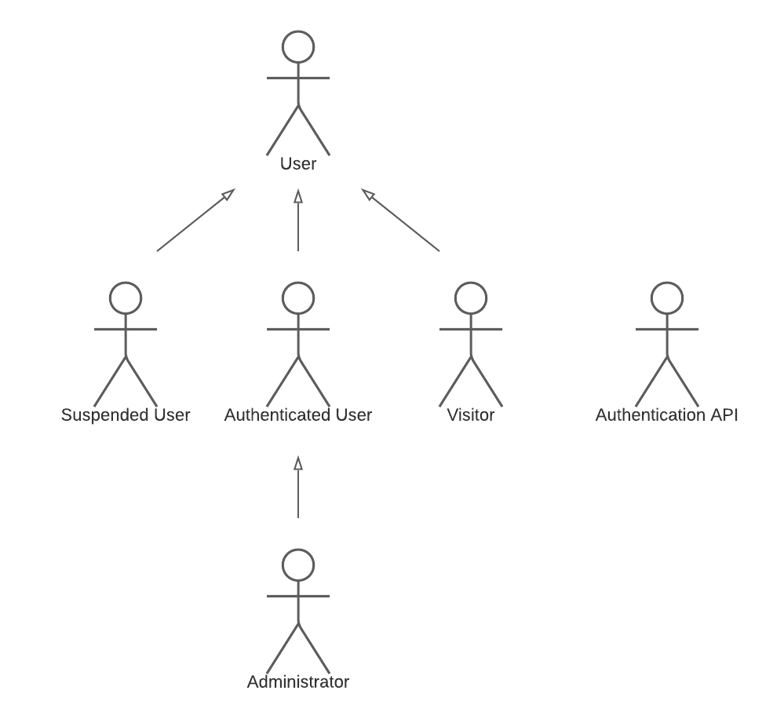
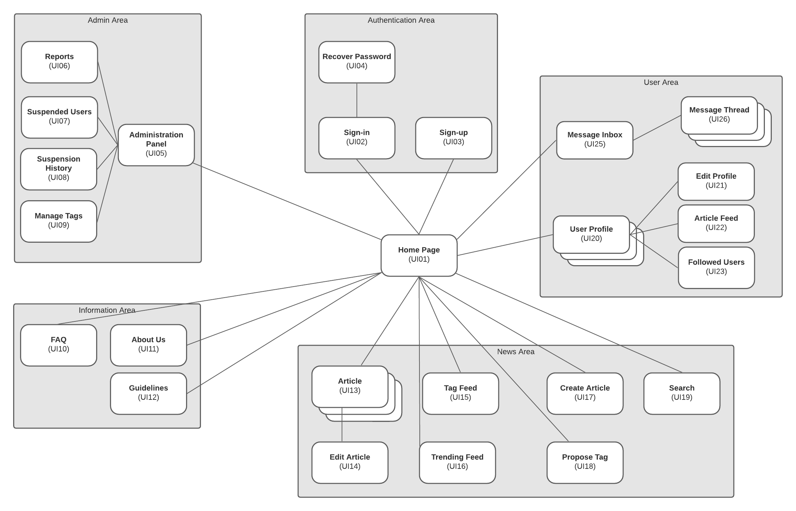
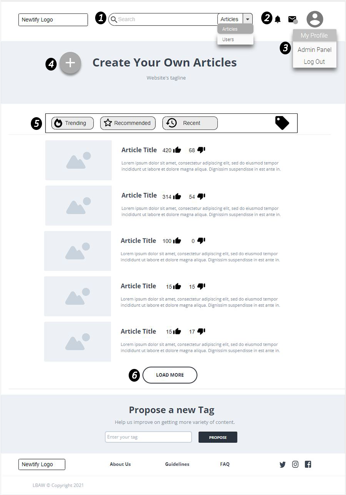
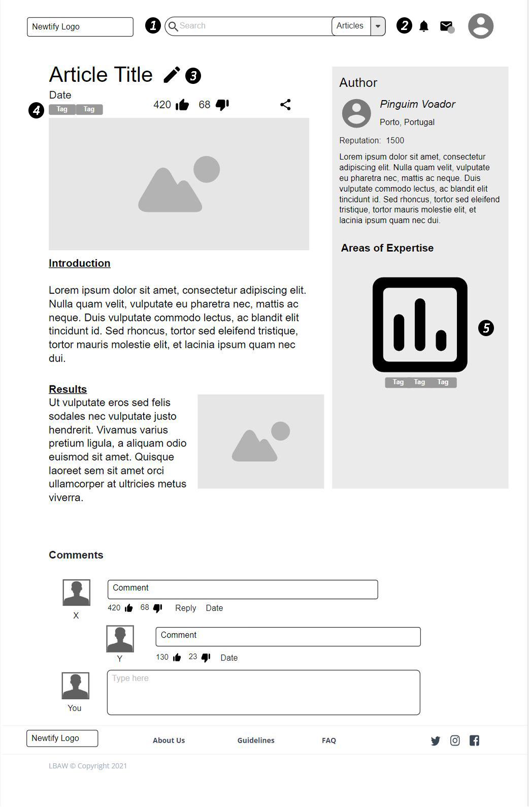
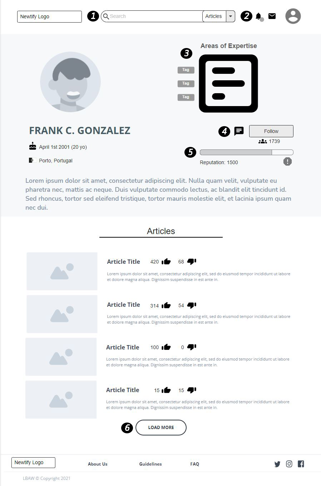

# ER: Requirements Specification Component

  

Newtify aims to bring an innovative news system to the market, whose content is fully maintained by its users. This Web Application allows users to contribute to the community, by writing news or reading them, and providing their feedback.

## A1: Newtify

  

The goal of the Newtify Project is the development of a Collaborative News platform maintained by its users. This is a tool that can be used by any person, independent of their age or interests, to both read and write news articles. A team of administrators is defined, which will be responsible for managing the system and ensuring the website guidelines are followed.

This application allows the users to publish and visualize news. What differentiates this product from other news websites is the absence of specialized authors and the consequent freedom of the articles, providing equal opportunities to all the writers. Their relevance and reach is defined by other users' feedback.

Users are separated into groups with different permissions. These groups include: the visitors; the authenticated users, with an account registered in the system, that have all the permissions visitors have and some more; and the administrators, which are the most unrestricted group.

The main page of the application displays a news feed. These are described by tags (between one and three), allowing all the users to search for specific articles and filter their feed. Visitors will only be able to read them, see user profiles and create an account.

On the other hand, the authenticated users may create articles and provide feedback to them, in the form of comments, likes or dislikes. They will also have a profile which contains information about themselves, including their username, avatar, nationality, age and description, which they can customize. It'll also automatically display their published articles, reputation and areas of expertise (based on their article's feedback and corresponding tags). Additionally, they will be able to specify their preferred tags and follow other users, which is used to customize their feed. In order to expand the reach of the website and maintain its integrity, they can propose new tags and report other users. The website also includes a messaging system for users to use, with a specified inbox and a message feed between each user in contact.

Regarding administrators, they are also capable of managing the website by deleting articles, analyzing reports, deactivating accounts and accepting new tags.
  

The Application has an adaptive design, providing the end-user a pleasant browsing experience, regardless of the device's specifications. It also includes an intuitive user interface, that allows users to customize and filter their preferences, providing an easy navigation system.

---  
  

## A2: Actors and User stories (Collaborative News)

This artifact contains the specification of the actors and their user stories, describing the interaction of these actors with the system, serving as a support to the future development of the application.
There will also be an explanation of supplementary requirements, such as business rules, technical and other non-functional requirements of the system.
  
  

### 1. Actors

              Figure 1: Diagram identifying actors and their relationships

| Identifier         | Description                                                                                                                                                 |
|--------------------|-------------------------------------------------------------------------------------------------------------------------------------------------------------|
| User               | Generic user that has access to public information, such as news articles and user profiles                                                                 |
| Visitor            | Unauthenticated user that has the ability to sign-up and sign-in                                                                                            |
| Authenticated User | A user that can create articles, comment and like/dislike them, edit their profile, interact with other users, propose and choose their favorite tags       |
| Administrator      | An authenticated user responsible for managing users and articles, by deactivating accounts, removing articles and comments, analyzing user reports and tag proposals   |
| Suspended User     | A user, with a previously created account, that temporarily lost his privileges as an authenticated user                                                                |
| Authentication API | External API that can be used to register or authenticate into the system (Google, Facebook)                                                                |
| Share API          | External API that allows a user to share articles to the desired platform (Facebook, Twitter, Instagram)                                                    |

            Table 1: Table identifying the diferent actors and its descriptions

### 2. User Stories

For the Newtify Platform, consider the user stories that are presented in the following sections.

#### 2.1. User
| Identifier | Name                           | Priority | Description                                                                                                                                                  |
|------------|--------------------------------|----------|--------------------------------------------------------------------------------------------------------------------------------------------------------------|
| US001      | See Home feed                  | high     | As a *User*, I want to see a feed of news in the Home Page, so that I can view the currently trending articles                                               |
| US002      | Read articles                  | high     | As a *User*, I want to open an article's page, so that I can read all the details about it                                                                   |
| US003      | Read comments                  | high     | As a *User*, I want to read comments in an article, so that I can view other people's opinions and thoughts                                                  |
| US004      | Search                         | high     | As a *User*, I want to search articles and profiles, so that I can easily find what I desire                                           |
| US005      | Filter                         | high     | As a *User*, I want to filter the feed, so that I can see articles which are more relevant to me (e.g by tag or release date)                                                            |
| US006      | View profiles                  | high     | As a *User*, I want to view other users' profile, so that I can know more about them and see their articles                                                  |
| US007      | See likes/dislikes             | medium     | As a *User*, I want to see how many likes and dislikes a given article or comment has, so that I can quickly understand how it was received by the community |
| US008      | See About Us                   | medium   | As a *User*, I want to visit the About Us page, so that I can see more information about the website and its creators                                        |
| US009      | View guidelines                | medium   | As a *User*, I want to see the platform guidelines, so that I am aware of their rules and ideals                                                             |
| US010      | Share articles                 | medium   | As a *User*, I want to be able to share articles in social media(Facebook, Twitter, Instagram), so that I can show them to my friends                                                      |
| US011      | Check if content's been edited | low      | As a *User*, I want to see whether an article or comment has been edited, so that I know if there's been any change since its publication                    |
| US012      | Consult FAQ                    | low      | As a *User*, I want to consult the FAQ page, so that I can clarify common questions                                                                          |

                Table 2: Table identifying User Stories and its descriptions

#### 2.2. Visitor

| Identifier | Name                  | Priority | Description                                                                                                                               |
|------------|-----------------------|----------|-------------------------------------------------------------------------------------------------------------------------------------------|
| US101      | Sign-in               | high     | As a *Visitor*, I want to sign in the website, so that I can use all the features that are only available to authenticated users          |
| US102      | Sign-up               | high     | As a *Visitor*, I want to register in the website, so that I can own a personal account and become an authenticated user                  |
| US103      | Sign-in with Auth API | medium   | As a *Visitor*, I want to sign in through an external API, so that I can be easily authenticated                                          |
| US104      | Sign-up with Auth API | medium   | As a *Visitor*, I want to sign up through an external API, so that I can create an account connected to an external account I already own |
| US105      | Recover password      | medium   | As a *Visitor*, I want to be able to recover my password through e-mail, so that I can reclaim my account in case I forget my password    |

                Table 3: Table identifying Visitor Stories and its descriptions

#### 2.3. Authenticated User
| Identifier |           Name          | Priority | Description                                                                                                                                                      |
|------------|:-----------------------:|----------|------------------------------------------------------------------------------------------------------------------------------------------------------------------|
| US201      | Logout                  | high     | As an <em>Authenticated User</em>, I want to be able, so that I can log out of my account                                                                        |
| US202      | View Personal Profile   | high     | As an <em>Authenticated User</em>, I want to be able to visit my own profile, so that I check what others can see about me (e.g username, posts, description...) |
| US203      | Edit Personal Profile   | high     | As an <em>Authenticated User</em>, I want to be able to edit my own profile, so that I can update information (e.g changing password, username, avatar...)       |
| US204      | Delete Account          | high     | As an <em>Authenticated User</em>, I want to be able to delete my account, so that I can erase my information on the system                                      |
| US205      | Post Article            | high     | As an <em>Authenticated User</em>, I want to be able to post an article with specific tags, so that other users can see it                                       |
| US206      | Edit Article            | high     | As an <em>Authenticated User</em>, I want to be able to edit an already posted article, so that I update information about it                                    |
| US207      | Delete Article          | high     | As an <em>Authenticated User</em>, I want to be able to delete a previous post, so that an article I wrote is no longer visible to anyone                        |
| US208      | See Customized Feed     | high     | As an <em>Authenticated User</em>, I want to be able to see my customized feed, so that I can see articles about my preferred tags and posted by Users I follow  |
| US209      | Edit Comment            | high     | As an <em>Authenticated User</em>, I want to be able to edit a comment I made to an article, so that I change what other users can see about it  
| US210      | Create Comment          | high     | As an <em>Authenticated User</em>, I want to be able to create a comment on an article, so that other users see my opinion about it                         |
| US211      | Remove Comment          | high     | As an <em>Authenticated User</em>, I want to be able to remove a comment I made to an article, so that other users cannot see it anymore                         |
| US212      | Follow User             | high     | As an <em>Authenticated User</em>, I want to be able to follow an Authenticated User, so that I can see his posts on my customized feed                          |
| US213      | Unfollow User           | high     | As an <em>Authenticated User</em>, I want to be able to unfollow an Authenticated User, so that my customized feed is not influenced with it                     |
| US214      | See Followed Users      | high     | As an <em>Authenticated User</em>, I want to be able to see a list of users that I follow, so that I can manage it                                               |
| US215      | See Favorite Tags      | high     | As an <em>Authenticated User</em>, I want to be able to see my favorite tags, so that I can decide if I want to change them |
| US216      | Change Favorite Tags   | high     | As an <em>Authenticated User</em>, I want to be able to choose, change or delete my favorite tags, so that my feed gets customized according to them            |
| US217      | Report Users  | high   | As an <em>Authenticated User</em>, I want to be able to report other users, so that I can help to maintain the website's guidelines     |
| US218      | Like Article            | medium     | As an <em>Authenticated User</em>, I want to be able to like an article, so that I can provide a positive feedback to it                                         |
| US219      | Dislike Article         | medium     | As an <em>Authenticated User</em>, I want to be able to dislike an article, so that I can provide a negative feedback to it                                      |
| US220      | Remove Like Article     | medium     | As an <em>Authenticated User</em>, I want to be able to remove the like I gave on an article, so that I can remove my positive feedback about it                 |
| US221      | Remove Dislike Article  | medium     | As an <em>Authenticated User</em>, I want to be able to remove the dislike I gave on an article, so that I can remove my negative feedback about it              |
| US222      | Comment Feedback        | medium     | As an <em>Authenticated User</em>, I want to be able to give feedback (like, dislike and comment) to a comment, so that I can express my opinion about it        |
| US223      | Remove Comment Feedback | medium     | As an <em>Authenticated User</em>, I want to be able to remove the feedback (like, dislike) I gave to a comment, so that other users cannot see it anymore      |
| US224      | Notifications           | medium   | As an <em>Authenticated User</em>, I want to be notified of new activity in my content, so that I can keep up with the feedback i receive                        |
| US225      | Propose New Tags        | medium   | As an <em>Authenticated User</em>, I want to be able to propose new tags to administrators, so that I can help with the improvement of the application           |
| US226      | See Message Inbox       | medium   | As an <em>Authenticated User</em>, I want to be able to see my messages Inbox, so that I can see the people I'm in contact with                                  |
| US227      | Send Message            | medium   | As an <em>Authenticated User</em>, I want to be able to send messages to other users, so that I can communicate with them                                        |
| US228      | Receive Message         | medium   | As an <em>Authenticated User</em>, I want to be able to receive messages from other users, so that they can communicate with me                                  |
| US229      | See Message Thread      | medium   | As an <em>Authenticated User</em>, I want to be able to see the thread of messages that I have with a user, so that I can see the conversation history          |

            Table 4: Table identifying Athenticated User Stories and its descriptions
#### 2.4. Administrator

| Identifier | Name                   | Priority | Description                                                                                                                                      |
|------------|------------------------|----------|--------------------------------------------------------------------------------------------------------------------------------------------------|
| US301      | Delete articles           | high     | As an *Administrator*, I want to be able to delete articles, so that the system rules are maintained                                       |
| US302      | Suspend user account   | high     | As an *Administrator*, I want to be able to suspend a user's account, so that he cannot log in for a period of time                               |
| US303      | Delete comments        | high     | As an *Administrator*, I want to be able to delete comments, so that the system rules are maintained                                               |
| US304      | See reports            | high     | As an *Administrator*, I want to be able to see the reports done by other users, so that I can analyze them and take measures about them         |
| US305      | Unsuspend user account | high     | As an *Administrator*, I want to be able to unsuspend a user account, so that he can log in into it again                                       |
| US306      | Accept/Reject news tags             | high     | As an *Administrator*, I want to be able to accept a new tag proposed by *Authenticated Users*, so that they can use it, or reject it                     |
| US307      | Profile identification | high     | As an *Administrator*, I want to have an Identification on my profile, so that other users can see that I'm an *Administrator*                     |
| US307      | Remove tag             | medium   | As an *Administrator*, I want to be able to remove an existing tag of the system, so that It cannot be used anymore                              |
| US308      | See suspended users    | medium   | As an *Administrator*, I want to be able to see all the suspended users, so that I can manage the application suspensions                        |
| US309      | See suspension history | low      | As an *Administrator*, I want to be able to see all the users that have been suspended at least one time, so that I can check users' previous behavior |

            Table 5: Table identifying Administrator Stories and its descriptions

#### 2.5. Suspended User
| Identifier | Name                              | Priority | Description                                                                                                                        |
|------------|-----------------------------------|----------|------------------------------------------------------------------------------------------------------------------------------------|
| US401      | View remaining time of suspension | high     | As a *Suspended User*, I want to see the remaining time of my suspension, so that I can know when to come back                           |
| US402      | Blocked log-in                    | high     | As a *Suspended User*, I want to be alerted of why I'm unable to login, so that I can understand why the log-in action is not working |
| US403      | Notification of Suspension        | medium   | As a *Suspended User*, I want to receive an email notifying that I was suspended with the respective reason, so that I can acknowledge my account status      |

            Table 6: Table identifying Suspended User Stories and its descriptions
  

### 3. Supplementary Requirements
This section contains business rules, technical requirements and other requirements of the Newtify project.

#### 3.1. Business rules
The following table contains the most important business rules of our system.

| Identifier | Name                              | Description                                                                                                                                                                              |
|------------|-----------------------------------|------------------------------------------------------------------------------------------------------------------------------------------------------------------------------------------|
| BR01       | User interaction with own content | Users are not allowed to like or dislike their own articles, as this could influence the outcome of their reputation and areas of expertise |
| BR02       | Account deletion                  | When an account is deleted, the articles, comments and likes/dislikes they've published remain on the website, but anonymously                                                           |
| BR03       | Account suspension visibility     | When an account is suspended, the articles and comments they've published remain on the website anonymously, unless the administrator decides to delete them                                          |
| BR04       | Account suspension reason         | An administrator must only suspend a user in case of violation of Newtify's guidelines, and never for personal reasons                                                                   |
| BR05       | Publication dates                 | News articles publication date must be earlier than the current one                                                                                                                      |
| BR06       | Authored content deletion         | An article or comment cannot be deleted by its author if it has votes or comments                                                                                                        |
| BR07       | Comments deletion                 | When a comment is deleted, it's seen as an empty comment with a "deleted" message and its replies remain. The likes/dislikes are hidden                                                                                 |
| BR08       | Article deletion                  | When an article is deleted, all the information contained in it is also erased, including the comments                                                                                 |
| BR09       | User reputation                   | User reputation is dependent on the likes and dislikes received on his articles or comments                                                                                              |
| BR10       | Admin reports                     | An administrator cannot review reports against him                                                                                                                                       |
| BR11       | Limited number of tags            | Each article must contain between 1 and 3 tags                                                                                                                                           |
| BR12       | Minimum age                       | Users must have a minimum age of 12 years to use the website                                                                                                                        |
                Table 7: Table identifying Business Rules and its descriptions
#### 3.2. Technical requirements
The following table contains the technical aspects the system must meet, such as performance-related, reliability and availability concerns. The three most critical requirements are highlighted.

| Identifier | Name            | Description                                                                                                                                                                                                                                                                       |
|------------|-----------------|-----------------------------------------------------------------------------------------------------------------------------------------------------------------------------------------------------------------------------------------------------------------------------------|
|**TR01**      | **Performance**     | **The system should have response times faster than 2 seconds, to ensure the user's focus**                                                                                                                                                                                              |
| TR02       | Robustness      | The system shall be prepared to handle and continue functioning when runtime errors arise                                                                                                                                                                                            |
| **TR03**       | **Scalability**     | **The system must be ready to deal with the growth in the number of users and respective activity**                                                                                                                                                                                     |
| TR04       | Accessibility   | The system ought to ensure that anyone can access the website, regardless of having any handicap or not, or the browser they use                                                                                                                                       |
| TR05       | Availability    | The system must be accessible pratically all the time of the day                                                                                                                                                                                                        |
| **TR06**       | **Usability**       | **The system shall be intuitive and easy to use. The Newtify platform is designed to be used by people of all ages and interests, with or without technical experience**                                                                                                                |
| TR07       | Web application | Newtify should be implemented as a web application with dynamic pages (HTML5, JavaScript, CSS and PHP). It is crucial that the system is smoothly accessible from any machine without the need to install specific tools or software, by working with standard technologies. |
| TR08       | Portability     | The application must work across multiple platforms and operating systems. In order to make Newtify easily available to a large user base, it needs to be platform-independent.                                                                    |
| TR09       | Security        | The system must protect users' private information from unauthorised parties, by using an authentication system                                                                                                                                                                                                             |                                                                                                                                                                                      |
| TR10       | Ethics          | The system must respect the ethical principles in software development (e.g. personal user details shouldn't be collected nor shared without full awareness and permission from its owner)                                                      |

            Table 8: Table identifying Technical Requirements and its descriptions

#### 3.3. Restrictions

The following table contains some restrictions the project must follow.

| Identifier | Name        | Description                                                                                              |
|------------|-------------|----------------------------------------------------------------------------------------------------------|
| C01        | Deadline    | The system should be ready to be used at the end of this first semester.                                             |
| C02        | Team Size   | The system must be developed by a team of no more than four students.                                    |
| C03        | Development | The system must be developed following the rules and structure proposed by the professors of the classes. |

            Table 9: Table identifying Project Restrictions and its descriptions
  

---

  
  

## A3: Information Architecture

This artefact shows an overview of the information architecture of the application being developed. It is subdivided into the following sections:
- A sitemap, showing the relationship between the different pages of the website and how the information fits together. This will help to expose the user requisites and raise new ones.
- A group of wireframes, used to show the planned page layout and design. This will allow to pratically test the user interface of the system. 

### 1. Sitemap

            Figure 2: Newtify's sitemap

### 2. Wireframes

Here are the wireframes of the most important pages of the website. Each one has a list of descriptions clarifying some elements of the page.

#### UI01: Home Page

            Figure 3: Wireframe showing the layout of the Home Page

1. Quick access to the search feature, for either articles or users
2. Icons that allow access to the notifications and messages pages. The dot below the envelope icon is alerting for a new message.
3. The admin panel, inside the user dropdown menu, is only available for administrators of the website.
4. This button redirects the user to a page where he can write an article. If the user isn't authenticated, he's redirected to the log-in page instead.
5. This section allows for the filtering of the news feed. The rightmost icon will allow the user to filter it by tags.
6. When the `load more` button is used, more articles will appear in the same page, increasing its vertical size.

#### UI13: Article Page

            Figure 4: Wireframe showing the layout of an article's page

1. Quick access to the search feature, for either articles or users
2. Icons that allow access to the notifications and messages pages. The dot below the envelope icon is alerting for a new message.
3. This icon allows the author to edit his article. It only appears if the user wrote the given article.
4. Tags which quickly describe the content of the article.
5. Graph exposing the author's areas of expertise and his reputation on those areas.

#### UI20: User Profile

        Figure 5: Wireframe showing a profile, from the perspective of another user

1. Quick access to the search feature, for either articles or users
2. Icons that allow access to the notifications and messages pages. The dot below the bell icon is alerting for a new notification.
3. Graph exposing the user's areas of expertise and his reputation on those areas.
4. This section includes buttons for sending a message and following/unfollowing the user, as well as displaying the number of followers.
5. The bar provides a visual representation of the user's reputation shown below. The righmost icon allows other users to report him.
6. When the `load more` button is used, more articles will appear in the same page, increasing its vertical size.

---
  

## Revision history

Changes made to the first submission:
- Added social media to user stories
- Removed what users can do in BR01
- Added User Story for reporting content
- Changed feedback US's to medium priority
- Removed non-page components from sitemap

***

GROUP2111, 26/10/2021

  

* Bruno Rosendo, up201906334@fe.up.pt (Editor)

* João Mesquita, up201906682@fe.up.pt

* Jorge Costa, up201706518@fe.up.pt

* Rui Alves, up201905853@fe.up.pt
