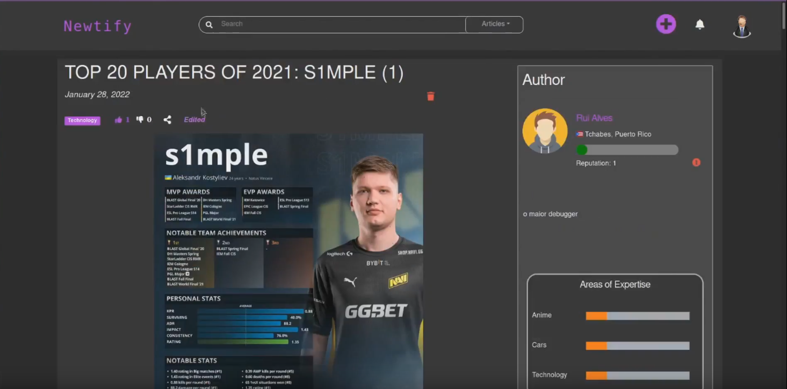

# PA: Product and Presentation

Newtify aims to bring an innovative news system to the market, whose content is fully maintained by its users. This Web Application allows users to contribute to the community, by writing news or reading them, and providing their feedback.

## A9: Product

### 1. Installation

Final version of the source code [here](https://git.fe.up.pt/lbaw/lbaw2122/lbaw2111/-/tags/Final)

Full Docker command to test the group's Docker Hub image using the DBM database:

```
docker run -it -p 8000:80 --name=lbaw2111 -e DB_DATABASE="lbaw2111" -e DB_SCHEMA="lbaw2111" -e DB_USERNAME="lbaw2111" -e DB_PASSWORD="iROcBrWt" git.fe.up.pt:5050/lbaw/lbaw2122/lbaw2111
```

### 2. Usage

URL to the product: http://lbaw2111.lbaw.fe.up.pt

#### 2.1. Administration Credentials

| Username           | Password     |
| ------------------ | ------------ |
| lbawadmin@fe.up.pt | lbawadmin123 |

#### 2.2. User Credentials

| Type              | Username               | Password         |
| ----------------- | ---------------------- | ---------------- |
| basic account     | lbawuser@fe.up.pt      | lbawuser123      |
| suspended account | lbawsuspended@fe.up.pt | lbawsuspended123 |

### 3. Application Help

The application's design is intuitive and the main CRUD actions are straightforward for the users. Still, we implemented ways to explain the concepts where we saw need. For example, many of the buttons in the website provide tooltips when the cursor hovers them for some time:


Additionally, all the textboxes include placeholders that inform the user for of their purpose, and there are messages informing them of possible input errors.

### 4. Input Validation

Inputs are validated using HTML and PHP validators as shown in the examples below:

**User password validation (HTML Validation)**
This input is being validated upon every change to tell the user if the password and password confirmation are matching. It also marks the field as required.

```
<input type="password" required class="w-auto h4 editInputs" id="newPassInput" name='new_password' placeholder="New Password" onkeyup="checkPass('#newPassInput')" />
```

**Edit Profile form validator (Server Validation)**

```
$user = User::find($id);
if (is_null($user))
    return redirect()->back()->withErrors(['user' => 'User not found, id: ' . $id]);

$this->authorize('update', $user);

$validator = Validator::make($request->all(), [
    'name' => 'nullable|string|max:255',
    'email' => 'nullable|string|email|max:255|unique:authenticated_user',
    'password' => 'required_with:new_password,email|string|password',
    'new_password' => 'nullable|string|min:6|confirmed',
    // Minimum: 12 years old
    'birthDate' => 'nullable|string|date_format:Y-m-d|before_or_equal:'.date('Y-m-d', strtotime('-12 years')),
    'country' => 'nullable|string|exists:country,name',
    'avatar' => 'nullable|image|mimes:jpg,png,jpeg,gif,svg|max:4096', // max 5MB
    'description' => 'nullable|string|max:500',
    'city' => 'nullable|string|max:100',
    'favoriteTags' => 'nullable|array',
    'favoriteTags.*' => [
        'integer',
        Rule::exists('tag', 'id')->where('state', 'ACCEPTED')
    ],
], ['before_or_equal' => 'You must be at least 12 years old']);

if ($validator->fails()) {
    $errors = [];
    foreach ($validator->errors()->messages() as $key => $value) {
        if (str_contains($key, 'favoriteTags'))
            $key = 'favoriteTags';
        $errors[$key] = is_array($value) ? implode(',', $value) : $value;
    }

    // Go back to form and refill it
    return redirect()->back()->withInput()->withErrors($errors);
}
```

### 5. Check Accessibility and Usability

Accessibility results: 16/18
Usability results: 24/28

[Accessibility Results](./accessibility.pdf)

[Usability Results](./usability.pdf)

### 6. HTML & CSS Validation

There are some errors in the HTML of the main pages of the website, as can be seen in the following reports:

[HTML Homepage Validation](./htmlHomeValidation.pdf)

[HTML Article Page Validation](./htmlArticleValidation.pdf)

On the other hand, CSS validation has only 1 error regarding a shortcut in aspect-ratio's value:

[CSS App Styles Validation](./cssAppValidation.pdf)

[CSS Mobile Styles Validation](./cssMobileValidation.pdf)

### 7. Revisions to the Project

The admin's suspended users and suspension history's pages have been merged into one, contrary to what was specified in the requirement's wireframe. Aside from that,
git there were only some minor UI changes.

### 8. Implementation Details

#### 8.1. Libraries Used

We used the following libraries and frameworks:

#### Bootstrap([link](https://getbootstrap.com/))

An open source toolkit for developing with HTML, CSS, and JS, to quickly adapt the website to different screen sizes and include custom styling with Sass variables.

#### Laravel([link](https://laravel.com/))

A PHP Framework For Web Artisans, that provides the strucure and starting point for creating our application.

#### Font Awesome([link](https://fontawesome.com/))

Icon set and toolkit to use consistent icons in the whole App.

#### Laravel Share([link](https://github.com/jorenvh/laravel-share))

Laravel package to handle the generation of share links in different social media. This feature can be seen in any Article Page, such as this [one](http://lbaw2111.lbaw.fe.up.pt/article/72).

#### Laravel Socialite([link](https://laravel.com/docs/8.x/socialite))

Laravel package to authenticate with OAuth API, more specifically with Google, as it can be seen in the [login page](http://lbaw2111.lbaw.fe.up.pt/login).

#### Pusher([link](https://pusher.com/))

Library to ease the process of sending and receiving push notifications. Push notifications do not work in the remote server, but can be seen locally in the navbar.

#### Select2([link](https://select2.org/))

Select2 provides a customizable select box with support for searching, tagging, remote data sets, infinite scrolling, and many other highly used options. This is used whenever we allow users to input tags, such as when filtering articles in the [homepage](http://lbaw2111.lbaw.fe.up.pt/).

#### TinyMCE([link](https://www.tiny.cloud/))

Customizable rich text editor that we use to create/edit articles to provide the user a good user experience, such as in the [Create Article Page](http://lbaw2111.lbaw.fe.up.pt/article).

#### Date Range Picker([link](https://www.daterangepicker.com/))

A JavaScript component for choosing date ranges, dates and times. This component is used in our App to provide a friendly date input for the user, such as in the homepage to filter articles by interval.

#### 8.2 User Stories

#### 8.2.1 User

| US Identifier | Name                           | Module                             | Priority | Team Members                                | State |
| ------------- | ------------------------------ | ---------------------------------- | -------- | ------------------------------------------- | ----- |
| US001         | See Home feed                  | M03 : Articles                     | High     | João Mesquita, Bruno Rosendo, Rui Alves     | 100%  |
| US002         | Read articles                  | M03 : Articles                     | High     | João Mesquita, Rui Alves                    | 100%  |
| US003         | Read comments                  | M04 : Comments                     | High     | **Bruno Rosendo**, João Mesquita, Rui Alves | 100%  |
| US004         | Search                         | M03 : Articles                     | High     | **Bruno Rosendo**                           | 100%  |
| US005         | Filter                         | M03 : Articles                     | High     | **Bruno Rosendo**, João Mesquita            | 100%  |
| US006         | View profiles                  | M02 : Profile and User Information | High     | **João Mesquita**                           | 100%  |
| US007         | See likes/dislikes             | M03 : Articles                     | Medium   | João Mesquita, Bruno Rosendo, Rui Alves     | 100%  |
| US008         | See About Us                   | M08 : Static Pages                 | Medium   | **Rui Alves**                               | 100%  |
| US009         | View guidelines                | M08 : Static Pages                 | Medium   | **Rui Alves**                               | 100%  |
| US010         | Share articles                 | M03 : Articles                     | Medium   | **João Mesquita**                           | 100%  |
| US011         | Check if content's been edited | M03 : Articles                     | Low      | **Bruno Rosendo**                           | 100%  |
| US012         | Consult FAQ                    | M08 : Static Pages                 | Low      | **Rui Alves**                               | 100%  |

#### 8.2.2 Visitor

| US Identifier | Name                  | Module               | Priority | Team Members      | State |
| ------------- | --------------------- | -------------------- | -------- | ----------------- | ----- |
| US101         | Sign-in               | M01 : Authentication | High     | **Jorge Costa**   | 100%  |
| US102         | Sign-up               | M01 : Authentication | High     | **Jorge Costa**   | 100%  |
| US103         | Sign-in with Auth API | M01 : Authentication | Medium   | **Bruno Rosendo** | 100%  |
| US104         | Sign-up with Auth API | M01 : Authentication | Medium   | **Bruno Rosendo** | 100%  |
| US105         | Recover password      | M01 : Authentication | Low      | **Rui Alves**     | 100%  |

Note: US103, US104 and US105 are not functioning in LBAW's server, due to comunication issues with external APIs

#### 8.2.3 Authenticated User

| US Identifier | Name                    | Module                             | Priority | Team Members                            | State |
| ------------- | ----------------------- | ---------------------------------- | -------- | --------------------------------------- | ----- |
| US201         | Logout                  | M01 : Authentication               | High     | **João Mesquita**                       | 100%  |
| US202         | View Personal Profile   | M02 : Profile and User Information | High     | **João Mesquita**, Bruno Rosendo        | 100%  |
| US203         | Edit Personal Profile   | M02 : Profile and User Information | High     | **João Mesquita**, Bruno Rosendo        | 100%  |
| US204         | Delete Account          | M02 : Profile and User Information | High     | **João Mesquita**, Rui Alves            | 100%  |
| US205         | Post Article            | M03 : Articles                     | High     | **Rui Alves**, João Mesquita            | 100%  |
| US206         | Edit Article            | M03 : Articles                     | High     | **Rui Alves**, João Mesquita            | 100%  |
| US207         | Delete Article          | M03 : Articles                     | High     | **Rui Alves**                           | 100%  |
| US208         | See Customized Feed     | M03 : Articles                     | High     | **Bruno Rosendo**                       | 100%  |
| US209         | Edit Comment            | M04 : Comments                     | High     | **Bruno Rosendo**                       | 100%  |
| US210         | Create Comment          | M04 : Comments                     | High     | **Bruno Rosendo**                       | 100%  |
| US211         | Remove Comment          | M04 : Comments                     | High     | **Bruno Rosendo**                       | 100%  |
| US212         | Follow User             | M02 : Profile and User Information | High     | **Rui Alves**                           | 100%  |
| US213         | Unfollow User           | M02 : Profile and User Information | High     | **Rui Alves**                           | 100%  |
| US214         | See Followed Users      | M02 : Profile and User Information | High     | João Mesquita, Rui Alves, Bruno Rosendo | 100%  |
| US215         | See Favorite Tags       | M05 : Tags                         | High     | **João Mesquita**                       | 100%  |
| US216         | Change Favorite Tags    | M05 : Tags                         | High     | **João Mesquita**                       | 100%  |
| US217         | Report Users            | M02 : Profile and User Information | High     | **João Mesquita**                       | 100%  |
| US218         | Like Article            | M03 : Articles                     | Medium   | Rui Alves, Bruno Rosendo                | 100%  |
| US219         | Dislike Article         | M03 : Articles                     | Medium   | Rui Alves, Bruno Rosendo                | 100%  |
| US220         | Remove Like Article     | M03 : Articles                     | Medium   | Rui Alves, Bruno Rosendo                | 100%  |
| US221         | Remove Dislike Article  | M03 : Articles                     | Medium   | Rui Alves, Bruno Rosendo                | 100%  |
| US222         | Comment Feedback        | M04 : Comments                     | Medium   | **Bruno Rosendo**                       | 100%  |
| US223         | Remove Comment Feedback | M04 : Comments                     | Medium   | **Bruno Rosendo**                       | 100%  |
| US024         | Notifications           | M06 : Messages and Notifications   | Medium   | **Bruno Rosendo**                       | 100%  |
| US225         | Propose New Tags        | M05 : Tags                         | Medium   | **Bruno Rosendo**                       | 100%  |
| US226         | See Message Inbox       | M06 : Messages and Notifications   | Medium   | N/A                                     | 0%    |
| US227         | Send Message            | M06 : Messages and Notifications   | Medium   | N/A                                     | 0%    |
| US228         | Receive Message         | M06 : Messages and Notifications   | Medium   | N/A                                     | 0%    |
| US229         | See Message Thread      | M06 : Messages and Notifications   | Medium   | N/A                                     | 0%    |

#### 8.2.4 Administrator

| US Identifier | Name                    | Module                    | Priority | Team Members                 | State |
| ------------- | ----------------------- | ------------------------- | -------- | ---------------------------- | ----- |
| US301         | Delete articles         | M07 : User Administration | High     | **Rui Alves**                | 100%  |
| US302         | Suspend user account    | M07 : User Administration | High     | Jorge Costa, Rui Alves       | 100%  |
| US303         | Delete comments         | M07 : User Administration | High     | **Bruno Rosendo**            | 100%  |
| US304         | See reports             | M07 : User Administration | High     | Jorge Costa, Rui Alves       | 100%  |
| US305         | Unsuspend user account  | M07 : User Administration | High     | Jorge Costa, Rui Alves       | 100%  |
| US306         | Accept/Reject news tags | M07 : User Administration | High     | Jorge Costa, Rui Alves       | 100%  |
| US307         | Profile identification  | M07 : User Administration | High     | João Mesquita, Bruno Rosendo | 100%  |
| US307         | Remove tag              | M07 : User Administration | Medium   | Jorge Costa, Rui Alves       | 100%  |
| US308         | See suspended users     | M07 : User Administration | Medium   | Jorge Costa, Rui Alves       | 100%  |
| US309         | See suspension history  | M07 : User Administration | Low      | Jorge Costa, Rui Alves       | 100%  |

#### 8.2.5 Suspended User

| US Identifier | Name                              | Module               | Priority | Team Members      | State |
| ------------- | --------------------------------- | -------------------- | -------- | ----------------- | ----- |
| US401         | View remaining time of suspension | M01 : Authentication | High     | **Bruno Rosendo** | 100%  |
| US402         | Blocked log-in                    | M01 : Authentication | High     | **Bruno Rosendo** | 100%  |
| US403         | Notification of Suspension        | M01 : Authentication | Medium   | N/A               | 0%    |

---

## A10: Presentation

### 1. Product presentation

The goal of the Newtify Project was the development of a Collaborative News platform maintained by its users. This is a tool that can be used by any person, independent of their age or interests, to both read and write news articles. A team of administrators is defined, which will be responsible for managing the system and ensuring the website guidelines are followed.

The website is based on HTML5, JavaScript, and CSS. The Bootstrap5 library was used for the frontend and the PHP framework Laravel was used for the backend. The platform has an intuitive and responsive design, allowing any person to contribute to the world of news and help win the fight against the spread of incorrect information.

URL to the product: http://lbaw2111.lbaw.fe.up.pt

### 2. Video presentation

#### Video screenshot



#### [Video Link WMV](https://drive.google.com/file/d/1JyyhvOm8E6kllqEsYN_rRZ2isruDgoij/view?usp=sharing)

#### [Video Link MP4](https://drive.google.com/file/d/15nTG3x4UUe8nJI-C61CsqEiNxAwHWJi6/view?usp=sharing)

---

## Revision history

Changes made to the first submission:

- Fixed a bug in some browsers, where TinyMCE was preventing the creation of articles.

---

GROUP2111, 28/01/2022

- Bruno Rosendo, up201906334@fe.up.pt
- João Mesquita, up201906682@fe.up.pt
- Jorge Costa, up201706518@fe.up.pt (Editor)
- Rui Alves, up201905853@fe.up.pt
